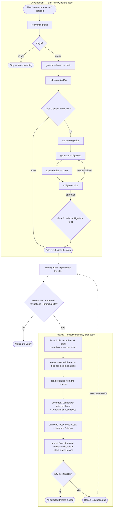

# Ingrain Security

**Threat assessment for coding agents, run as the final step of implementation planning.**

A Claude Code / Codex plugin. Once your implementation plan is comprehensive and
detailed — but *before* any code is written or the plan is presented — Ingrain
Security threat-models the plan and folds the results back into it.

- Repository: <https://github.com/ingrainlabs/ingrain-security>
- License: MIT

## What it does

Security analysis is treated as the last step of planning, not a separate pass
afterward. When a plan is ready, the plugin triages the change, and for
security-relevant ("major") changes runs a full review: it enumerates threats,
scores their risk, lets **you** choose which threats to address, proposes
mitigations for the ones you picked, and lets you choose which mitigations to
adopt. The selected threats and adopted mitigations become part of the plan the
coding agent then implements.

## How it works

The full spec lives in [`skills/ingrain-security/SKILL.md`](skills/ingrain-security/SKILL.md);
the short version:

- **Triage first.** Only "major" (security-relevant) changes get the full review;
  "minor" changes stop immediately with nothing to fold in.
- **The review loop:** threats → 0–100 risk score → **Gate 1** (you pick which
  threats to address, 0–N) → org rules → mitigations → **Gate 2**
  (you pick which mitigations to adopt, 0–N). Threat and mitigation drafts each pass
  through a critic with up to 3 revision rounds.
- **Org rules.** Your org's security rules are retrieved once, from the plan and the
  selected threats, before any mitigation exists. They land in a rules sidecar next to
  the assessment, which the mitigation generator and critic both read.
- **Worker roles.** The orchestrator dispatches six worker roles as fresh
  subagents — `ingrain-relevance-triage`, `ingrain-threat-generator`,
  `ingrain-threat-critic`, `ingrain-risk-scorer`, `ingrain-mitigation-generator`,
  `ingrain-mitigation-critic` (defined under
  [`skills/ingrain-security/references/development/`](skills/ingrain-security/references/development/)).
  Each worker's sole write is its own section of the assessment file.
- **Two selection gates are yours.** At Gate 1 and Gate 2 you decide, per finding,
  what gets addressed. Selecting none is always allowed.
- **Then the code gets tested against the threats.** Once the plan is implemented, the
  **Testing** phase grades how robust the applied mitigations turned out to be — see
  [Verifying the implementation](#verifying-the-implementation) below.

The whole lifecycle, both phases end to end — **Development** before code, **Testing** after:



## Verifying the implementation

Planning adopts mitigations; the **Testing** phase of the same skill checks they were built. `ingrain-security`
has two phases and picks between them from repo state: **Development** is the plan review above,
run before code; **Testing** (spec:
[`skills/ingrain-security/references/testing/verification-pass.md`](skills/ingrain-security/references/testing/verification-pass.md))
runs after you implement a task whose plan went through that review. It measures **how robust
the applied mitigations are** — by **negative testing**: whether the threats the plan selected
can still be realized against the code as built. The threats define the scope. It locates the
task's assessment file, reviews the **branch diff since this branch diverged from its parent**
(committed and uncommitted alike), and dispatches one read-only `ingrain-threat-verifier` per
selected threat — each holding that threat, the adopted mitigations meant to close it, and the
org rules behind them from the `rules-<…>.md` sidecar. A threat the plan selected but adopted
nothing for is tested too.

Each verifier justifies before it concludes, and the skill **weighs that justification on its
evidence** rather than taking the level word at face value: a level the cited `file:line` does
not carry does not stand, and the level recorded is the orchestrator's own conclusion.

It reports each threat's robustness — `weak` (the threat can still be realized), `adequate`
(its realization routes are closed), or `strong` (closed broadly *and* backed by artefacts such
as adversarial tests) — with evidence and, for `weak`, the concrete residual path by which the
attack still gets through. Whether a mitigation matches the wording of its Description is not
the bar; a control built to spec that still leaves its threat reachable is `weak` coverage.
Judging robustness is left to the analyzing agent — the levels define what was tested, not a
rubric to execute. It marks the assessment checked by recording each threat's **Robustness**
and, on each covering mitigation, its **Justification** + the **Robustness** it inherits, and
advancing the file's
stage to `testing`. It writes no code, runs no user gates, and makes no `ingrain` CLI call:
each verifier reads the org rules back from the `rules-<…>.md` sidecar Development persisted.

- **On the skill's own trigger.** The skill description tells the agent to run Testing after it
  implements code for a reviewed plan, before presenting or committing it. Nothing enforces this
  at the turn boundary — it is the agent acting on the description, so treat it as a strong
  default rather than a guarantee.
- **Manual.** Invoke the skill after implementing — e.g. *"Use ingrain-security to verify the
  mitigations I just implemented."* Naming the phase is enough to select it; otherwise the skill
  routes on state (an assessment for this task, carrying adopted mitigations, plus a non-empty
  branch delta — committed or uncommitted → Testing). This is the reliable way to run it.

If a task has no assessment (or no adopted mitigations), there is nothing to verify.

### Artifacts

- A single **assessment file** written into the `.ingrain-security/` folder at your
  project root — `.ingrain-security/assessment-<branch>-<task>.md` (branch- and
  task-keyed, minted by the `scripts/mint-assessment-path` script). It is the workers'
  shared hand-off medium *and* its own persisted record — written in place, no temp
  copy — and is git-ignored by default (share one with `git add -f <file>`).
- The selected findings, **folded into your plan**.

Writes to that one file are approved automatically — by a `PreToolUse` hook on Claude
Code and a `PermissionRequest` hook on Codex — so a review does not interrupt you with a
permission prompt on every edit. The grant is deliberately narrow: `assessment*.md`
files sitting directly in the project's `.ingrain-security/` folder, reached by a real path
rather than a symlink. On Codex, where an edit is an `apply_patch`, the patch may add or
update exactly those files. Everything else — including the folder's own
`README.md` — still goes through your normal permission prompt, and the hook's only power
is to *skip* a prompt: an edit you asked for always goes through. Codex asks you to review and trust the
hook once, via `/hooks`.

## Installation

Add the marketplace to your host, then install the `ingrain-security` plugin:

```
# Claude Code
/plugin marketplace add ingrainlabs/ingrain-security

# Codex
codex plugin marketplace add ingrainlabs/ingrain-security
```

Installs are pinned to the `v<version>` git **tag**, not the default branch — you
only ever receive tagged releases.

Full setup — including the `ingrain` CLI binary, API token, and configuration — is
documented at **[Getting started](https://docs.ingrainlabs.dev/getting-started/)**.

## Usage

- **Automatic.** A SessionStart hook injects the skill into every session, so the
  agent runs the review at the end of planning. On Claude Code, a
  `PostToolUse:ExitPlanMode` hook also nudges it to run before code is written.
- **Manual.** Invoke it via the Skill tool, or just ask — e.g.
  *"Use Ingrain Security to threat-model this implementation plan before I write
  code."*
- At **Gate 1** (threats) and **Gate 2** (mitigations), you choose what gets
  addressed — each finding is an individual include/exclude decision, and excluding
  everything is a valid outcome (recorded as accepted risk).

## Requirements & limits

| Platform | Requirement |
|----------|-------------|
| macOS / Linux | System `bash` + coreutils — already present. |
| **Windows** | **[Git for Windows](https://git-scm.com/download/win) is required.** |

| Tool | Needed for | If missing |
|------|-----------|------------|
| `bash` | every hook and skill script | on Windows, the automatic review won't fire (see below) |
| [`jq`](https://jqlang.github.io/jq/) | the two permission hooks that read the tool payload | a permission prompt on every assessment write and script run |
| `git` | resolving the repo root and the branch delta to review | the review still runs, scoped to the working tree instead of the branch |

**Why Git for Windows.** The plugin's hooks are bash scripts run through
[`hooks/run-hook.cmd`](hooks/run-hook.cmd), a cmd/bash polyglot wrapper. On Windows
it invokes them with the bash it finds at `C:\Program Files\Git\bin\bash.exe` or any
`bash` on `PATH` (Git Bash / MSYS2 / Cygwin). Installing Git for Windows — whose
bundled **Git Bash** satisfies this — is the simplest way to meet the requirement.

**Graceful degradation.** If no bash is found on Windows, the wrapper exits silently:
the plugin still installs, but loses the SessionStart context injection and the
assessment-folder seeding, so the automatic review won't fire. You can still invoke
the skill manually.

**What the review writes.** The review's only writes are the assessment file and the
findings folded into your plan.

**Sandboxing & network access.** The review's only outbound network calls are the
read-only `ingrain context security_rules` lookups of its two rule-retrieval passes —
one per distinct question it needs org guidance on — which fetch your org's security rules
(via `INGRAIN_SYNC_URL` + API token). Grant that one command once and the lookups run
unprompted for good:

```jsonc
// Claude Code — /permissions, or .claude/settings.json
{ "permissions": { "allow": ["Bash(ingrain context:*)"] } }
```

```python
# Codex — ~/.codex/rules/default.rules
prefix_rule(
    pattern = ["ingrain", "context"],
    decision = "allow",
    justification = "read-only org security-rule lookups for ingrain-security",
)
```

Allowing permissions, you don't have to accept them every time. 

**The assessment folder is git-ignored.** `.ingrain-security/` is ignored
by default. To share a snapshot, force-add it: `git add -f <file>`.

## For contributors

- Release process and versioning: [`.github/README.md`](.github/README.md)
- Test suite (Deno-based): [`tests/README.md`](tests/README.md)

## License

MIT — see [`LICENSE`](LICENSE).
