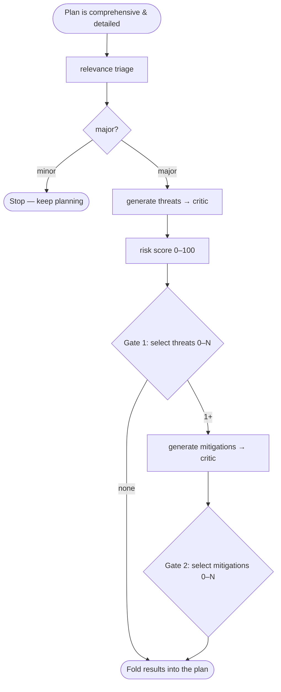

# Ingrain Security

**Threat assessment for coding agents, run as the final step of implementation planning.**

A Claude Code / Codex plugin. Once your implementation plan is comprehensive and
detailed — but *before* any code is written or the plan is presented — Ingrain
Security threat-models the plan and folds the results back into it. It is
**read-only on your codebase**: it never edits code.

- Repository: <https://github.com/ingrainlabs/ingrain-security>
- License: MIT

## What it does

Security analysis is treated as the last step of planning, not a separate pass
afterward. When a plan is ready, the plugin triages the change, and for
security-relevant ("major") changes runs a full review: it enumerates threats,
scores their risk, lets **you** choose which threats to address, proposes
mitigations for the ones you picked, and lets you choose which mitigations to
adopt. The selected threats and adopted mitigations become part of the plan the
coding agent then implements.

## How it works

The full spec lives in [`skills/ingrain-security/SKILL.md`](skills/ingrain-security/SKILL.md);
the short version:

- **Triage first.** Only "major" (security-relevant) changes get the full review;
  "minor" changes stop immediately with nothing to fold in.
- **The review loop:** threats → 0–100 risk score → **Gate 1** (you pick which
  threats to address, 0–N) → mitigations → **Gate 2** (you pick which mitigations to
  adopt, 0–N). Threat and mitigation drafts each pass through a critic with up to 3
  revision rounds.
- **Read-only workers.** The orchestrator dispatches six worker roles as fresh
  subagents — `ingrain-relevance-triage`, `ingrain-threat-generator`,
  `ingrain-threat-critic`, `ingrain-risk-scorer`, `ingrain-mitigation-generator`,
  `ingrain-mitigation-critic` (defined under
  [`skills/ingrain-security/references/`](skills/ingrain-security/references/)).
  Each uses only Read/Grep/Glob on your codebase; its sole write is its own section
  of the assessment file.
- **Two selection gates are yours.** At Gate 1 and Gate 2 you decide, per finding,
  what gets addressed. Selecting none is always allowed.



### Artifacts

- A single **assessment file** written into the `.ingrain-security/` folder at your
  project root — `.ingrain-security/assessment-<branch>-<task>.md` (branch- and
  task-keyed, minted by the `scripts/assessment-path` script). It is the workers'
  shared hand-off medium *and* its own persisted record — written in place, no temp
  copy — and is git-ignored by default (share one with `git add -f <file>`).
- The selected findings, **folded into your plan**.

Writes to that one file are approved automatically — by a `PreToolUse` hook on Claude
Code and a `PermissionRequest` hook on Codex — so a review does not interrupt you with a
permission prompt on every edit. The grant is deliberately narrow: only `assessment*.md`
files sitting directly in the project's `.ingrain-security/` folder, and never through a
symlink. On Codex, where an edit is an `apply_patch`, the patch must touch nothing but
those files and may only add or update them. Everything else — including the folder's own
`README.md` — still goes through your normal permission prompt, and the hook can only
*skip* a prompt, never block an edit you asked for. Codex asks you to review and trust the
hook once, via `/hooks`.

## Installation

Add the marketplace to your host, then install the `ingrain-security` plugin:

```
# Claude Code
/plugin marketplace add ingrainlabs/ingrain-security

# Codex
codex plugin marketplace add ingrainlabs/ingrain-security
```

Installs are pinned to the `v<version>` git **tag**, not the default branch — you
only ever receive tagged releases.

Full setup — including the `ingrain` CLI binary, API token, and configuration — is
documented at **[Getting started](https://docs.ingrainlabs.dev/getting-started/)**.

## Usage

- **Automatic.** A SessionStart hook injects the skill into every session, so the
  agent runs the review at the end of planning. On Claude Code, a
  `PostToolUse:ExitPlanMode` hook also nudges it to run before code is written.
- **Manual.** Invoke it via the Skill tool, or just ask — e.g.
  *"Use Ingrain Security to threat-model this implementation plan before I write
  code."*
- At **Gate 1** (threats) and **Gate 2** (mitigations), you choose what gets
  addressed — each finding is an individual include/exclude decision, and excluding
  everything is a valid outcome (recorded as accepted risk).

## Requirements & limits

| Platform | Requirement |
|----------|-------------|
| macOS / Linux | System `bash` + coreutils — nothing extra to install. |
| **Windows** | **[Git for Windows](https://git-scm.com/download/win) is required.** |

**Why Git for Windows.** The plugin's hooks are bash scripts run through
[`hooks/run-hook.cmd`](hooks/run-hook.cmd), a cmd/bash polyglot wrapper. On Windows
it invokes them with the bash it finds at `C:\Program Files\Git\bin\bash.exe` or any
`bash` on `PATH` (Git Bash / MSYS2 / Cygwin). Installing Git for Windows — whose
bundled **Git Bash** satisfies this — is the simplest way to meet the requirement.

**Graceful degradation.** If no bash is found on Windows, the wrapper exits silently:
the plugin still installs, but loses the SessionStart context injection and the
assessment-folder seeding, so the automatic review won't fire. You can still invoke
the skill manually.

**Read-only guarantee.** The workers never edit code. The only writes the review
makes are the assessment file and the findings folded into your plan.

**Sandboxing & network access.** The review's only outbound network calls are the
mitigation generator's read-only `ingrain context security_rules` lookups — one per
distinct question it needs org guidance on — which fetch your org's security rules
(via `INGRAIN_SYNC_URL` + API token). If you run your coding agent under a sandbox
that restricts network or command execution, **allow those `ingrain context` CLI
runs** so org-rule retrieval works. Without it the review still
completes — it just degrades gracefully and proposes mitigations without your org's rules.

**The assessment folder is git-ignored.** `.ingrain-security/` is ignored
by default. To share a snapshot, force-add it: `git add -f <file>`.

## For contributors

- Release process and versioning: [`.github/README.md`](.github/README.md)
- Test suite (Deno-based): [`tests/README.md`](tests/README.md)

## License

MIT — see [`LICENSE`](LICENSE).
