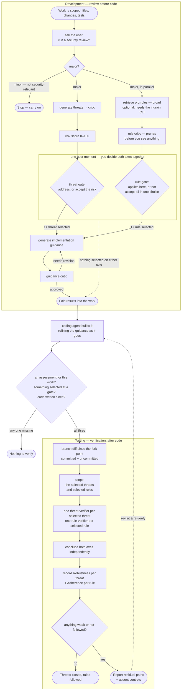

# Ingrain Security

**Automated security review for coding agents**

A Claude Code / Codex plugin. Once you have a detailed enough view of the work you are doing —
but *before* any code is written — Ingrain Security reviews it on two axes: the threats it
introduces, and (optionally) the org security rules that govern it. The results are fed straight
back into the agent's work.

- Repository: <https://github.com/ingrainlabs/ingrain-security>
- License: MIT

## What it does

Security analysis is treated as the last step before code. Once you know what you are about to
build, the plugin asks whether this change gets a security review, and for a "major" one runs a full
review along **two driver axes**: *threats* (what could go wrong here, risk-scored) and (optional) — with
the [`ingrain` CLI](https://docs.ingrainlabs.dev/getting-started/) — *org rules* (which of your
standing security requirements govern this change). You decide each axis — which threats to
address, and which rules apply — and the plugin then proposes **implementation guidance** for
what you selected. The selected drivers and the guidance become part of what the coding agent
goes on to build.

Once the work is implemented, the same skill's **Testing** phase checks the code against both
axes — see [Verifying the implementation](#verifying-the-implementation).

**The plugin stands alone.** The threat review runs entirely on your machine with the plugin
alone. The optional [`ingrain` CLI](https://docs.ingrainlabs.dev/getting-started/) adds two
capabilities: it retrieves **your org's security rules** so they become the second driver axis,
and it **syncs finished assessments** to the Ingrain platform so a team can read them. Sections
marked *(optional — needs the CLI)* cover those.

## Installation

Add the marketplace to your host, then install the `ingrain-security` plugin:

```
# Claude Code
/plugin marketplace add ingrainlabs/ingrain-security

# Codex
codex plugin marketplace add ingrainlabs/ingrain-security
```

Installs are pinned to the `v<version>` git **tag**.

That is the whole install — the review runs from here.

**Optional — the `ingrain` CLI.** To add org-rule retrieval and platform syncing, install the CLI
binary and configure its API token: **[Getting started](https://docs.ingrainlabs.dev/getting-started/)**.

## Usage

- **Automatic.** The plugin puts the skill in the agent's context at the start of every session,
  so the agent runs the review itself once it knows what it is about to build — in plan mode or
  straight from the conversation.
- **Manual.** Invoke it via the Skill tool, or just ask — e.g.
  *"Use Ingrain Security to threat-model what we just worked out, before I write
  code."*
- At the **threat gate** — and, with the CLI, the **rule gate** alongside it in the same
  moment — you choose what is in scope. Each is an individual include/exclude decision, and
  excluding everything is a valid outcome: threats are recorded as accepted risk, rules as deemed
  inapplicable. The rule gate offers accept-all first, so the common case costs one choice.

## Requirements

| Platform | Requirement |
|----------|-------------|
| macOS / Linux | System `bash` + coreutils — already present. |
| **Windows** | **[Git for Windows](https://git-scm.com/download/win) is required.** |

| Tool | Used for |
|------|----------|
| `bash` | every hook and skill script |
| [`jq`](https://jqlang.github.io/jq/) | the two permission hooks that read the tool payload |
| `git` | resolving the repo root and the branch delta to review |
| `ingrain` CLI *(optional)* | org-rule retrieval and syncing to the platform |

**Why Git for Windows.** The plugin's hooks are bash scripts run through
[`hooks/run-hook.cmd`](hooks/run-hook.cmd), a cmd/bash polyglot wrapper. On Windows
it invokes them with the bash it finds at `C:\Program Files\Git\bin\bash.exe` or any
`bash` on `PATH` (Git Bash / MSYS2 / Cygwin). Installing Git for Windows — whose
bundled **Git Bash** satisfies this — supplies that bash, and the automatic review then fires as
it does everywhere else.

## Permissions & network access

**What the review writes.** The review's only writes are the assessment file and the
findings folded into the work in hand.

**The assessment folder is git-ignored.** `.ingrain-security/` is ignored by default. To share
a snapshot, force-add it: `git add -f <file>`.

**Outbound calls** *(optional — needs the CLI)*. With the CLI installed, the review makes two
kinds of call, both through it (via `INGRAIN_SYNC_URL` + API token):

- **Reads** — `ingrain context security_rules`, one per distinct question a rule-retrieval pass
  needs org guidance on.
- **Writes** — `ingrain record design` at the Development finalize and `ingrain record verification`
  at the Testing finalize, which upload the assessment: threats, the gated rule set, the
  implementation guidance, your decisions on both axes, and the verdicts.
  [Syncing to the platform](#syncing-to-the-platform) details what leaves your machine.

Grant both once and they run unprompted from then on:

```jsonc
// Claude Code — /permissions, or .claude/settings.json
{ "permissions": { "allow": ["Bash(ingrain context:*)", "Bash(ingrain record:*)"] } }
```

```python
# Codex — ~/.codex/rules/default.rules
prefix_rule(
    pattern = ["ingrain", "context"],
    decision = "allow",
    justification = "read-only org security-rule lookups for ingrain-security",
)
prefix_rule(
    pattern = ["ingrain", "record"],
    decision = "allow",
    justification = "uploads the finished assessment to your org's platform",
)
```

Grant `ingrain context` alone to keep org rules while reviewing locally; the syncs then ask each
time. Leave the CLI unconfigured and the review runs wholly on your machine.

---

## How it works

The full spec lives in [`skills/ingrain-security/SKILL.md`](skills/ingrain-security/SKILL.md);
the short version:

- **You decide whether it runs.** The review opens with one question — *run a security review
  for this change?* — recommending yes whenever the change plausibly touches a security surface,
  because a needless review is cheap and a missed concern is not. Answer "not security-relevant"
  and it stops there, records that, and the agent carries on with the work.
- **Two axes, run in parallel.** After that the **threat chain** (generate → critique →
  risk-score 0–100 → **threat gate**) and, with the CLI, the **rule chain** (retrieve broadly →
  critique → **rule gate**) run side by side. Each is recall-then-precision: cast a wide net, then
  let a critic prune it before you see anything.
- **The gates are yours, in one moment.** The **threat gate** asks *act on it, or accept the
  risk*; the **rule gate** asks *does this rule apply here* — with an accept-all fast path, so
  the default costs one choice. Selecting none on either axis is always allowed, and an
  exclusion is recorded: "we looked and decided otherwise" is part of the record.
- **Guidance is generated, then yours to refine.** Once the gates close, one worker proposes
  **implementation guidance** against everything you selected — how each threat gets closed and
  each rule gets implemented. Every entry names **at least one driver**; an entry may serve
  several threats *and* several rules at once, and is written once naming them all. It is
  critiqued, then lands in the plan or outline the agent is working from, where **you refine it**
  like any other part of it.
- **Org rules ride in the assessment.** Retrieval writes the full set into the assessment's own
  `## Org rules` section; the gate records your decision per rule; finalize keeps the selected
  rules' bodies (Testing reads them as the specification) and reduces the excluded to a
  decision-only stub. One artifact carries the whole analysis.
- **Worker roles.** The orchestrator dispatches six worker roles as fresh
  subagents — `ingrain-threat-generator`,
  `ingrain-threat-critic`, `ingrain-risk-scorer`, `ingrain-rule-critic`,
  `ingrain-guidance-generator`, `ingrain-guidance-critic` (defined under
  [`skills/ingrain-security/references/development/`](skills/ingrain-security/references/development/)).
  Each worker's sole write is its own section of the assessment file.
- **Then the code gets checked against both axes.** Once the work is implemented, the
  **Testing** phase judges each selected threat for robustness and each selected rule for
  adherence — see [Verifying the implementation](#verifying-the-implementation) below.

Without the CLI the rule chain sits out, the review runs on the threat axis alone, and the
guidance stands on the workers' own analysis.

The whole lifecycle, both phases end to end — **Development** before code, **Testing** after:


```mermaid
flowchart TD
    subgraph DEV["Development — review before code"]
        planning(["Work is scoped: files, changes, tests"]) --> ask["ask the user:<br/>run a security review?"]
        ask --> majorQ{"major?"}
        majorQ -->|minor — not security-relevant| stop(["Stop — carry on"])
        majorQ -->|major| threats["generate threats → critic"]
        majorQ -->|major, in parallel| rules["retrieve org rules — broad<br/>optional: needs the ingrain CLI"]
        threats --> score["risk score 0–100"]
        rules --> rcritic["rule critic — prunes<br/>before you see anything"]
        score --> threatgate
        rcritic --> rulegate

        subgraph GATES["one user moment — you decide both axes together"]
            threatgate{"threat gate:<br/>address, or accept the risk"}
            rulegate{"rule gate:<br/>applies here, or not<br/>accept-all in one choice"}
        end

        threatgate -->|1+ threat selected| guidance["generate implementation guidance"]
        rulegate -->|1+ rule selected| guidance
        GATES -.->|nothing selected on either axis| folded(["Fold results into the work"])
        guidance --> gcritic["guidance critic"]
        gcritic -->|needs-revision| guidance
        gcritic -->|approved| folded
    end

    folded --> impl["coding agent builds it<br/>refining the guidance as it goes"]
    impl --> phase{"an assessment for this work?<br/>something selected at a gate?<br/>code written since?"}
    phase -->|any one missing| nothing(["Nothing to verify"])
    phase -->|all three| diff

    subgraph TEST["Testing — verification, after code"]
        diff["branch diff since the fork point<br/>committed + uncommitted"]
        diff --> scope["scope:<br/>the selected threats<br/>and selected rules"]
        scope --> verify["one threat-verifier per selected threat<br/>one rule-verifier per selected rule"]
        verify --> conclude["conclude both axes independently"]
        conclude --> record["record Robustness per threat<br/>+ Adherence per rule"]
        record --> weakQ{"anything weak or not-followed?"}
        weakQ -->|no| pass(["Threats closed, rules followed"])
        weakQ -->|yes| revisit(["Report residual paths<br/>+ absent controls"])
    end

    revisit -.->|revisit & re-verify| impl
```

## Verifying the implementation

The review states what should be true; the **Testing** phase of the same skill checks the code
as built. `ingrain-security` has two phases and picks between them from repo state:
**Development** is the review above, run before code; **Testing** (spec:
[`skills/ingrain-security/references/testing/verification-pass.md`](skills/ingrain-security/references/testing/verification-pass.md))
runs after you implement work that went through it.

Testing runs when three things hold together: an assessment exists for this task, it carries at
least one selected threat **or** selected rule, and the branch has a delta — committed or
uncommitted.

**How Testing gets run:**

- **On the skill's own trigger.** The skill description tells the agent to run Testing once it
  has implemented reviewed work, before presenting or committing it. The agent acts on that
  description, so treat it as a strong default.
- **Manual.** Invoke the skill after implementing — e.g. *"Use ingrain-security to verify the
  guidance I just implemented."* Naming the phase selects it outright, which makes this the
  reliable route; otherwise the skill routes on the repo state above.

It judges **both driver axes**: for each selected threat, whether it can still be realized —
**negative testing**; and for each selected rule, whether the control it prescribes is present.
The two gates define the scope. It locates the task's assessment file, reviews the **branch diff
since this branch diverged from its parent** (committed and uncommitted alike), and dispatches
one read-only `ingrain-threat-verifier` per selected threat and one `ingrain-rule-verifier` per
selected rule — each reading what it needs from that one assessment file. A threat selected at
the gate with no guidance written for it is tested too, and so is a selected rule nothing
implements.

Each verifier justifies before it concludes, and the skill **weighs that justification on its
evidence** rather than taking the level word at face value: a level stands when the cited
`file:line` carries it, and the level recorded is the orchestrator's own conclusion.

It reports each threat's robustness — `weak` (the threat can still be realized), `adequate`
(its realization routes are closed), or `strong` (closed broadly *and* backed by artefacts such
as adversarial tests) — with evidence and, for `weak`, the concrete residual path by which the
attack still gets through. Reachability is the bar: a control built exactly to the wording of its
Description still reads `weak` while its threat remains reachable. The levels define what was
tested, and judging robustness is the analyzing agent's call. It marks the assessment checked by
recording each threat's **Robustness**, the **Robustness justification** behind it, the
**Residual path** for a `weak` verdict and any **Evidence**, and advancing the file's stage to
`testing`.

**Guidance is the vessel** through which a threat gets closed and a rule gets implemented, so its
efficacy is read off the drivers beside it: the threat's robustness and the rule's adherence
carry the verdicts. Keeping the verdict on the drivers is what lets one entry serve both axes at
once and still mean one thing.

Testing reports, and the coding agent implements. Each verifier reads the org rules from the
assessment's own `## Org rules` section. Once the verdicts are written, the CLI can sync them —
see [Syncing to the platform](#syncing-to-the-platform).

### Were the org rules followed?

Testing runs a second, independent pass over the **org security rules you selected at the rule
gate**, and records `followed` | `not-followed` per rule in a `## Rule adherence` section of the
assessment. It answers a question of its own: *were the rules we set actually followed?* A
dedicated read-only `ingrain-rule-verifier` judges each rule against the code as built.

**Each dimension is judged against the code in its own right.** A rule can be followed while a
threat stays reachable — the rule governed input validation and the surviving route is an
authorisation gap — and violated while every threat is closed, because they were closed by other
means. Judging each on its own evidence is what keeps both answers trustworthy.

Three things the record holds:

- **Scope is your decision.** Only rules you **selected** at the rule gate are judged — including
  one no guidance ends up implementing, because you put it in scope and "not-followed — nothing
  implements it" is exactly what a security owner needs to see. A rule you **excluded** was deemed
  inapplicable, and the record keeps it as that decision.
- **One verdict per rule, judged against the code** — the question is always whether the control
  the rule prescribes exists.
- **The verdict tracks the code.** A rule satisfied by other means reads `followed` even where the
  guidance that would have implemented it was dropped during refinement; an absent control is the
  usual reason a rule reads `not-followed`.

A rule that drives guidance covering no threat is ordinary and fully in scope — a standing
requirement is a driver in its own right.

## The assessment file

- A single **assessment file** written into the `.ingrain-security/` folder at your
  project root — `.ingrain-security/assessment-<branch>-<task>.md` (branch- and
  task-keyed, minted by the `scripts/assessment-mint` script). It is the workers'
  shared hand-off medium *and* its own persisted record, written in place, and is
  git-ignored by default (share one with `git add -f <file>`).
- The selected findings, **folded into the work in hand**.

The assessment declares its own format under `## Task` as **`Schema version: 2`**, so a consumer
branches on a stated version rather than sniffing structure. Bump the version whenever a field is
added, removed, or given new allowed values, and record the plugin release that introduced it in
the table below, so "artifacts at version ≥ 2" stays checkable.

| Schema version | First plugin release | What it introduced |
| --- | --- | --- |
| 1 | ≤ 0.2.5 | the heading-per-entry layout that replaced the original tables; predates the `Schema version` line, so a consumer reads its absence as version 1 |
| 2 | *(set by the release that merges this change)* | **The two driver axes and the vessel between them.** `Description` and `Schema version` under `## Task`; `## Affected paths`; `## Org rules` carrying each retrieved rule's gate decision and verbatim body (the sidecar is gone); `## Implementation guidance` — renamed from `## Mitigations`, carrying no verdict and no Selection, every entry naming **at least one driver**; the three threat verification fields (`Robustness justification`, `Residual path`, `Evidence`); `## Rule adherence`; org rule ids written **in full, verbatim** — an id is an exact-match key; and **phase blocks** (`#### gen` / `#### score` / `#### usergate` / `#### test`) declaring stage ownership inside each `## Threats` entry |

**Version 2 was redefined rather than superseded**, which is worth stating once: no released
plugin has ever emitted a `Schema version` line at all — version 1 is the *absence* of one — so
there is no version-2 artifact anywhere for this shape to break. Bumping to 3 would have implied
an earlier v2 that consumers must still handle, and none exists.

**Phase blocks are tolerated in both directions**, so version 2 does not pin a layout. An entry
may group its fields under markers or run them flat; both parse to the same fields, and a
consumer reads a marker-less entry's verification fields exactly where they have always been.
That is what lets this plugin and the `ingrain` CLI move independently.

The version number is filled in by the release flow, which bumps it from the PR's `release:*`
label — see [`.github/RELEASING.md`](.github/RELEASING.md).

Writes to that one file are approved automatically — by a `PreToolUse` hook on Claude
Code and a `PermissionRequest` hook on Codex — so the review writes as it works. The grant is
deliberately narrow: `assessment*.md` files sitting directly in the project's
`.ingrain-security/` folder, reached by a real path. On Codex, where an edit is an `apply_patch`,
the patch may add or update exactly those files. The hook's one power is to skip a prompt for
that narrow set; everything else — including the folder's own `README.md` — follows your normal
permission flow. Codex asks you to review and trust the hook once, via `/hooks`.

## Syncing to the platform

*(Optional — needs the CLI.)* Both phases can end by uploading the assessment through the
`ingrain` CLI, so a team sees the threats a change introduced, what was decided about them, and
whether it was verified — in one place rather than in a git-ignored file on one developer's
machine.

| Finalize | Command | What it sends |
| --- | --- | --- |
| Development | `ingrain record design` | threats with their gate decisions, the gated rule set (selected and excluded alike), the risk score, and the implementation guidance with the drivers each entry names |
| Testing | `ingrain record verification` | a robustness verdict per selected threat and an adherence verdict per selected rule, against the revision they judged |

**The CLI owns the wire format.** The skill runs the command and reads the exit code, which keeps
this plugin vendor-neutral and lets the two ship on separate release cadences.

**Syncing is best-effort.** A review's own output is the assessment file and the report, and it
completes on its own; the upload adds to it. Where the CLI is absent, unconfigured or unreachable,
the review notes it in one line and carries on to the end.

**To keep everything local,** deny `ingrain record` in your host's permission settings, or leave
the CLI unconfigured. A CLI at a release that predates `Schema version: 2` reports an unknown
subcommand, and the review continues unsynced.

## For contributors

- Release process and versioning: [`.github/RELEASING.md`](.github/RELEASING.md)
- Test suite (Deno-based): [`tests/README.md`](tests/README.md)

## License

MIT — see [`LICENSE`](LICENSE).
