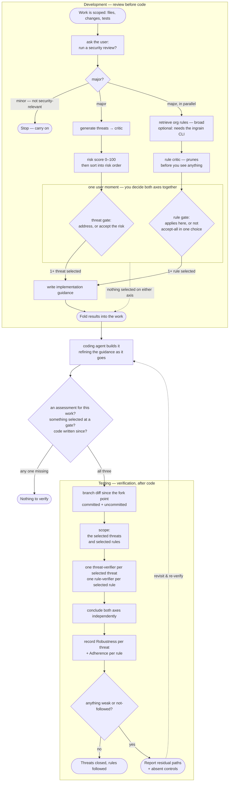

# Ingrain Security

**Automated security review for coding agents**

A Claude Code / Codex plugin. Once you have a detailed enough view of the work you are doing —
but *before* any code is written — Ingrain Security reviews it on two axes: the threats it
introduces, and (optionally) the org security rules that govern it. The results are fed straight
back into the agent's work.

- Repository: <https://github.com/ingrainlabs/ingrain-security>
- License: MIT

## What it does

Security analysis is treated as the last step before code. Once you know what you are about to
build, the plugin asks whether this change gets a security review, and for a "major" one runs a full
review along **two driver axes**: *threats* (what could go wrong here, risk-scored) and (optional) — with
the [`ingrain` CLI](https://docs.ingrainlabs.dev/getting-started/) — *org rules* (which of your
standing security requirements govern this change). You decide each axis — which threats to
address, and which rules apply — and the plugin then proposes **implementation guidance** for
what you selected. The selected drivers and the guidance become part of what the coding agent
goes on to build.

Once the work is implemented, the same skill's **Testing** phase checks the code against both
axes — see [Verifying the implementation](#verifying-the-implementation).

**The review runs entirely on your machine, and it needs two pieces.** This plugin is markdown;
the review executes through the [`ingrain` CLI](https://docs.ingrainlabs.dev/getting-started/),
so install both. What is genuinely *optional* is the platform: with an API token the CLI also
retrieves **your org's security rules** so they become the second driver axis, and **syncs
finished assessments** so a team can read them. Without one the threat review runs unchanged, on
its own axis, and nothing leaves your machine. Sections
marked *(optional — needs the CLI)* cover those.

## Installation

Add the marketplace to your host, then install the `ingrain-security` plugin:

```
# Claude Code
/plugin marketplace add ingrainlabs/ingrain-security

# Codex
codex plugin marketplace add ingrainlabs/ingrain-security
```

Installs are pinned to the `v<version>` git **tag**.

**That is half the install.** This plugin is markdown; the review runs through the `ingrain`
CLI, so install that too and make sure it is on your editor's `PATH`:
**[Getting started](https://docs.ingrainlabs.dev/getting-started/)**. Configuring an API token
on top is optional and adds org-rule retrieval and platform syncing — see
[Requirements](#requirements).

## Usage

- **Prompted.** The agent runs the review once it knows what it is about to build — in plan
  mode or straight from the conversation — when something tells it to. **The plugin does not
  enforce this and blocks nothing**: it ships prose, and if nobody invokes the skill, no review
  happens. Making it reliable is a one-time, copy-paste block in your project's `CLAUDE.md` or
  `AGENTS.md`: **[Making the review actually
  run](https://docs.ingrainlabs.dev/enforcement/running-the-review/)**. In CI the workflow
  supplies the instruction instead.
- **Not every change needs one.** When something other than you starts the review — the opt-in
  block, or the agent deciding at the end of planning — it opens by asking whether this change is
  security-relevant. Say no and it stops there: that answer is recorded, so the change reads as
  assessed rather than skipped, and you are not asked about it again.
- **Manual.** Invoke it via the Skill tool, or just ask — e.g.
  *"Use Ingrain Security to threat-model what we just worked out, before I write
  code."* Asking for it yourself skips that opening question; you have already answered it.
- At the **threat gate** — and, with the CLI, the **rule gate** alongside it in the same
  moment — you choose what is in scope. Each is an individual include/exclude decision, and
  excluding everything is a valid outcome: threats are recorded as accepted risk, rules as deemed
  inapplicable. The rule gate offers accept-all first, so the common case costs one choice.

## Requirements

| Tool | Used for |
|------|----------|
| **`ingrain` CLI** | **required** — the review runs through it |
| `git` | resolving the repo root, the branch, and the branch delta to review |
| `ingrain` + a platform token *(optional)* | org-rule retrieval and syncing to the platform |

**A plugin install is not enough on its own.** This plugin ships markdown; the review's
mechanical half — resolving where the assessment lives, working out what the branch changed,
and ordering threats by risk — is `ingrain assessment mint`, `ingrain delta` and
`ingrain assessment retag`. Install the CLI first ([installation
instructions](https://docs.ingrainlabs.dev/commands/install/)) and make sure it is on the
`PATH` your editor sees — a GUI-launched editor often has a different one from your shell.

If it is missing, the review stops at its first step with a message naming the remedy rather
than carrying on with a step quietly skipped.

**The platform stays optional.** Without a token the review runs on the threat axis alone: no
org rules, no syncing. What you lose is stated under [Syncing to the
platform](#syncing-to-the-platform), not discovered.

## Permissions & network access

**What the review writes.** The review's only writes are the assessment file and the
findings folded into the work in hand.

**The assessment folder is git-ignored.** `.ingrain-security/` is ignored by default. To share
a snapshot, force-add it: `git add -f <file>`.

**Outbound calls** *(optional — needs the CLI)*. With the CLI installed, the review makes two
kinds of call, both through it (via `INGRAIN_SYNC_URL` + API token):

- **Reads** — `ingrain context security_rules`, one per distinct question a rule-retrieval pass
  needs org guidance on.
- **Writes** — `ingrain record design` at the Development finalize and `ingrain record verification`
  at the Testing finalize, which upload the assessment: threats, the gated rule set, the
  implementation guidance, your decisions on both axes, and the verdicts.
  [Syncing to the platform](#syncing-to-the-platform) details what leaves your machine.

Grant both once and they run unprompted from then on:

```jsonc
// Claude Code — /permissions, or .claude/settings.json
{ "permissions": { "allow": ["Bash(ingrain context:*)", "Bash(ingrain record:*)"] } }
```

```python
# Codex — ~/.codex/rules/default.rules
prefix_rule(
    pattern = ["ingrain", "context"],
    decision = "allow",
    justification = "read-only org security-rule lookups for ingrain-security",
)
prefix_rule(
    pattern = ["ingrain", "record"],
    decision = "allow",
    justification = "uploads the finished assessment to your org's platform",
)
```

Grant `ingrain context` alone to keep org rules while reviewing locally; the syncs then ask each
time. Leave the CLI unconfigured and the review runs wholly on your machine.

---

## How it works

The short version — the internals are in
[`docs/technical-docs.md`](docs/technical-docs.md), and the spec the agent follows is
[`skills/ingrain-security/SKILL.md`](skills/ingrain-security/SKILL.md):

- **You decide whether it runs, and you are asked first.** The review opens with one question —
  *run a security review for this change?* — before it looks anything up or writes anything,
  recommending yes whenever the change plausibly touches a security surface, because a needless
  review is cheap and a missed concern is not. Answer "not security-relevant" and it stops there,
  records that, and the agent carries on with the work.
- **Two axes, run in parallel.** After that the **threat chain** (generate → critique →
  risk-score 0–100 → **threat gate**) and, with the CLI, the **rule chain** (retrieve broadly →
  critique → **rule gate**) run side by side. Each is recall-then-precision: cast a wide net, then
  let a critic prune it before you see anything.
- **The gates are yours, in one moment.** The **threat gate** asks *act on it, or accept the
  risk*; the **rule gate** asks *does this rule apply here* — with an accept-all fast path, so
  the default costs one choice. Selecting none on either axis is always allowed, and an
  exclusion is recorded: "we looked and decided otherwise" is part of the record.
- **Guidance is written, then yours to refine.** Once the gates close, the review proposes
  **implementation guidance** against everything you selected — how each threat gets closed and
  each rule gets implemented. Every entry names **at least one driver**; an entry may serve
  several threats *and* several rules at once, and is written once naming them all. It lands in
  the plan or outline the agent is working from, where **you refine it** like any other part of
  it — that is the editing surface, and verification later judges the code rather than the list.
- **Org rules ride in the assessment.** Retrieval writes the full set into the assessment's own
  `## Org rules` section; the gate records your decision per rule; finalize keeps the selected
  rules' bodies (Testing reads them as the specification) and reduces the excluded to a
  decision-only stub. One artifact carries the whole analysis.
- **The steps that need fresh eyes are their own agents.** Finding threats, critiquing them and
  judging which retrieved rules apply each run as a focused subagent with clean context. The rest
  — the opening question, the rule retrieval, the risk scoring, the guidance — is work whose
  inputs the review already has in hand, so it happens in place rather than costing a round trip.
  Sorting the scored threats into risk order is not judgement at all, so it is a script.
- **Then the code gets checked against both axes.** Once the work is implemented, the
  **Testing** phase judges each selected threat for robustness and each selected rule for
  adherence — see [Verifying the implementation](#verifying-the-implementation) below.

Without the CLI the rule chain sits out, the review runs on the threat axis alone, and the
guidance stands on the review's own analysis.

The whole lifecycle, both phases end to end — **Development** before code, **Testing** after:


```mermaid
flowchart TD
    subgraph DEV["Development — review before code"]
        planning(["Work is scoped: files, changes, tests"]) --> ask["ask the user:<br/>run a security review?"]
        ask --> majorQ{"major?"}
        majorQ -->|minor — not security-relevant| stop(["Stop — carry on"])
        majorQ -->|major| threats["generate threats → critic"]
        majorQ -->|major, in parallel| rules["retrieve org rules — broad<br/>optional: needs the ingrain CLI"]
        threats --> score["risk score 0–100<br/>then sort into risk order"]
        rules --> rcritic["rule critic — prunes<br/>before you see anything"]
        score --> threatgate
        rcritic --> rulegate

        subgraph GATES["one user moment — you decide both axes together"]
            threatgate{"threat gate:<br/>address, or accept the risk"}
            rulegate{"rule gate:<br/>applies here, or not<br/>accept-all in one choice"}
        end

        threatgate -->|1+ threat selected| guidance["write implementation guidance"]
        rulegate -->|1+ rule selected| guidance
        GATES -.->|nothing selected on either axis| folded(["Fold results into the work"])
        guidance --> folded
    end

    folded --> impl["coding agent builds it<br/>refining the guidance as it goes"]
    impl --> phase{"an assessment for this work?<br/>something selected at a gate?<br/>code written since?"}
    phase -->|any one missing| nothing(["Nothing to verify"])
    phase -->|all three| diff

    subgraph TEST["Testing — verification, after code"]
        diff["branch diff since the fork point<br/>committed + uncommitted"]
        diff --> scope["scope:<br/>the selected threats<br/>and selected rules"]
        scope --> verify["one threat-verifier per selected threat<br/>one rule-verifier per selected rule"]
        verify --> conclude["conclude both axes independently"]
        conclude --> record["record Robustness per threat<br/>+ Adherence per rule"]
        record --> weakQ{"anything weak or not-followed?"}
        weakQ -->|no| pass(["Threats closed, rules followed"])
        weakQ -->|yes| revisit(["Report residual paths<br/>+ absent controls"])
    end

    revisit -.->|revisit & re-verify| impl
```

## Verifying the implementation

The review states what should be true; the **Testing** phase of the same skill checks the code
as built. `ingrain-security` has two phases and picks between them from repo state:
**Development** is the review above, run before code; **Testing** (spec:
[`skills/ingrain-security/references/testing/verification-pass.md`](skills/ingrain-security/references/testing/verification-pass.md))
runs after you implement work that went through it.

Testing runs when three things hold together: an assessment exists for this task, it carries at
least one selected threat **or** selected rule, and the branch has a delta — committed or
uncommitted.

**How Testing gets run:**

- **On the skill's own trigger.** The skill description tells the agent to run Testing once it
  has implemented reviewed work, before presenting or committing it. The agent acts on that
  description, so treat it as a strong default.
- **Manual.** Invoke the skill after implementing — e.g. *"Use ingrain-security to verify the
  guidance I just implemented."* Naming the phase selects it outright, which makes this the
  reliable route; otherwise the skill routes on the repo state above.

It judges **both axes**: for each selected threat, whether it can still be realized — **negative
testing**; and for each selected rule, whether the control it prescribes is present. Your gate
decisions define the scope, and it reads the **branch diff since this branch diverged from its
parent**, committed and uncommitted alike. A threat you selected with no guidance written for it
is tested too, and so is a selected rule nothing implements.

It reports each threat's robustness — `weak` (the threat can still be realized), `adequate` (its
realization routes are closed), or `strong` (closed broadly *and* backed by artefacts such as
adversarial tests) — with evidence and, for `weak`, the concrete residual path by which the
attack still gets through. **Reachability is the bar:** a control built exactly to the wording of
its guidance still reads `weak` while its threat remains reachable.

Testing reports, and the coding agent implements. Once the verdicts are written, the CLI can
sync them — see [Syncing to the platform](#syncing-to-the-platform).

### Were the org rules followed?

Testing runs a second pass over the org rules you selected at the rule gate, recording
`followed` | `not-followed` per rule with its reasoning. It answers a question of its own:
*were the rules we set actually followed?*

- **Scope is your decision.** Only rules you **selected** are judged — including one no guidance
  ends up implementing, since "not-followed — nothing implements it" is exactly what a security
  owner needs to see. A rule you **excluded** is kept as that decision rather than judged.
- **The verdict tracks the code.** A rule satisfied by other means reads `followed` even where
  the guidance that would have implemented it was dropped along the way; an absent control is the
  usual reason a rule reads `not-followed`.

The two answers are independent and can differ: a rule can be followed while a threat stays
reachable, and violated while every threat is closed.

## The assessment file

- A single **assessment file** written into the `.ingrain-security/` folder at your
  project root — `.ingrain-security/assessment-<branch>-<task>.md` (branch- and
  task-keyed, minted by `ingrain assessment mint`). It is the workers'
  shared hand-off medium *and* its own persisted record, written in place, and is
  git-ignored by default (share one with `git add -f <file>`).
- The selected findings, **folded into the work in hand**.

It is plain markdown and yours to read or edit — the record of what was found and what you
decided. It states its own format under `## Task` as `Schema version`, so tools reading it can
tell which shape they have; the schema and its history are in the
[technical docs](docs/technical-docs.md#schema-versioning).

Writes to that one file are pre-approved through the skill's own `allowed-tools` frontmatter,
scoped to `.ingrain-security/`, so on a host that honours a path-scoped rule the review writes
as it works. Everything else follows your normal permission flow.


## Syncing to the platform

*(Optional — needs the CLI.)* Both phases can end by uploading the assessment through the
`ingrain` CLI, so a team sees the threats a change introduced, what was decided about them, and
whether it was verified — in one place rather than in a git-ignored file on one developer's
machine.

| Finalize | Command | What it sends |
| --- | --- | --- |
| Development | `ingrain record design` | threats with their gate decisions, the gated rule set (selected and excluded alike), the risk score, and the implementation guidance with the drivers each entry names |
| Testing | `ingrain record verification` | a robustness verdict per selected threat and an adherence verdict per selected rule, against the revision they judged |

**The CLI owns the wire format.** The skill runs the command and reads the exit code, which keeps
this plugin vendor-neutral and lets the two ship on separate release cadences.

**Syncing is best-effort.** A review's own output is the assessment file and the report, and it
completes on its own; the upload adds to it. Where the CLI is absent, unconfigured or unreachable,
the review notes it in one line and carries on to the end.

**To keep everything local,** deny `ingrain record` in your host's permission settings, or leave
the CLI unconfigured. A CLI at a release that predates `Schema version: 2` reports an unknown
subcommand, and the review continues unsynced.

## Unattended / CI

The review normally puts two questions to you — which threats to act on, and which of your org's
rules govern the change. With nobody at the keyboard there is no one to ask, and picking nothing
would mean no guidance and no verification pass. So set `INGRAIN_SECURITY_UNATTENDED` — to
`connected` when the runner has an `ingrain` API token, or `standalone` when it does not — and
each gate resolves on its own. **It takes one of those two words, not a flag**: anything else is
read as `connected`, and a runner with no token then attempts uploads it cannot make.

| Gate | What it does unattended |
| --- | --- |
| *Is this change worth reviewing?* | Takes **yes** — a needless review is cheap, a missed concern is not |
| *Which threats to act on?* | Selects everything above your org's **risk threshold**; the rest are reported but not required |
| *Which org rules apply?* | Accepts all of them, over a set already narrowed to this change |

**The threshold is your configuration, not ours.** Connected, it comes from the maturity band set
on the buckets covering the repository, so what CI enforces is changed in the product rather than
in a workflow file — and a band set in a workflow is refused there, because on a pull request that
file comes from the branch under review. Standalone has no buckets to read, so it takes the band
from `INGRAIN_SECURITY_BAND` (`low` | `medium` | `high`).

A stricter band means a lower bar: `high` requires work on anything scoring above
25, `medium` above 50, `low` above 75. With nothing configured anywhere it uses `high` — the
strictest — so the gate can never fail to resolve.

**Nothing is hidden.** A threat below the threshold is still reported, marked as accepted risk
rather than required work. The band and the exact threshold applied are recorded in the assessment,
so a reader can see what the run enforced instead of inferring it.

Standalone skips org-rule retrieval and both uploads and still produces the whole
threat review — which is also the stronger privacy posture, since nothing leaves the runner.

## For contributors

- Release process and versioning: [`.github/RELEASING.md`](.github/RELEASING.md)
- Test suite (Deno-based): [`tests/README.md`](tests/README.md)

## License

MIT — see [`LICENSE`](LICENSE).
