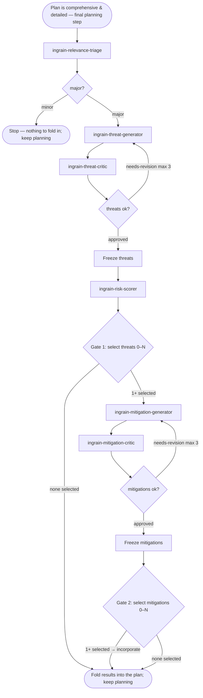

<SUBAGENT-STOP>
If you were dispatched as a worker subagent (ingrain-relevance-triage, ingrain-threat-generator,
ingrain-threat-critic, ingrain-risk-scorer, ingrain-mitigation-generator, ingrain-mitigation-critic), do the one
job you were given and return. Do NOT run this orchestration — you are part of it.
</SUBAGENT-STOP>

<EXTREMELY-IMPORTANT>
Security analysis is the FINAL step of planning, not a separate phase after it.
First build your implementation plan in full — the affected files, the concrete
implementations, the tests. This applies to both shapes of planning: an **ad-hoc
plan** worked out inline in the conversation (no plan mode, no plan artifact) and a
**formal planning session** (plan mode, a design doc, a written spec). The trigger
is the *state*, not the mode: the moment the plan is comprehensive and detailed and
no code has been written yet — reached by either path. Once that state holds, and
before you present it or write any code, run this review with the finished plan
as its input, then fold its results back into the plan. It still belongs to
planning: the plan you hand back already reflects it. If there is even a 1%
chance the change touches security, run it — triage decides minor vs. major, you
do not pre-judge it away.
</EXTREMELY-IMPORTANT>

# Security review loop

**Announce:** open with "Using ingrain-security to assess this plan."

You orchestrate six **read-only** worker roles, each defined by a reference file
at `references/<name>.md` (`ingrain-relevance-triage`, `ingrain-threat-generator`,
`ingrain-threat-critic`, `ingrain-risk-scorer`, `ingrain-mitigation-generator`,
`ingrain-mitigation-critic`). You dispatch each one as a fresh
subagent (see **How to dispatch a worker**), in order, holding the state between
steps yourself — workers cannot call each other or you. On revision rounds you
pass the worker its prior draft plus the critic's issues to address.

## How to dispatch a worker

A worker is a role defined by a reference file, not a platform-native agent. You
never run a worker's logic yourself — you dispatch a **fresh worker subagent**
(read-only on the codebase; its sole write is its own section of the assessment
file) and tell it to become that worker by reading its reference file. This keeps the
review cross-platform: it works
wherever a subagent primitive exists, and degrades to sequential in-context
execution where one does not. See `references/platform-dispatch.md` for the
per-platform mapping (host with a subagent/task primitive → that primitive;
no-subagent fallback → sequential in-context execution).

Dispatch every worker with the same shape — restate the read-only constraint
inline, because on hosts without tool-level enforcement it is the only thing
enforcing it. **Hand off by pointer, not by content:** tell the worker to write its
result into its own section of the stored analysis file and to return only a compact
status, and pass downstream workers a pointer to the sections they need to read
rather than pasting prior output into the prompt:

```
Read references/<name>.md and follow it as your system prompt.
You do no code or repo edits — use only Read/Grep/Glob on the codebase. Your ONE
permitted write is your own section of the stored analysis file at
.claude/.temp/assessment.md (section: <## Section for this worker>),
written to the schema in references/assessment-file.md — use exactly its fields and
enum values.
INPUT:
<the finished, detailed implementation plan; plus POINTERS to the sections this
worker must read — e.g. "read .claude/.temp/assessment.md § Threats and
§ Threat critique" — on revision rounds, the pointer to the prior draft's section +
the critic's itemized feedback>
Write your full Output into your section of the assessment file, then RETURN ONLY:
your branch keyword (minor/major, approved/needs-revision) or headline result, plus
a one-line pointer to the section you wrote. Do not return the full output.
```

Branch on the keyword the worker leads its return with (`minor`/`major`,
`approved`/`needs-revision`). Thread the pipeline by passing the **next** worker a
pointer to the sections it must read — the workers share no state, so the stored file
is the shared state.

**Context-window discipline:** do **not** read the full running analysis into your
own context during the loop. Hold only the compact statuses/pointers workers return.
Read a bounded slice of the file only when you must — at Gate 1 and Gate 2, to render
the prepared table for the user, and at finalize. This keeps your context lean across
the whole review.

## Model tiers

Dispatch every worker on a **cheap model** — they are narrow, mechanical,
read-only jobs that don't need a frontier model. You (the orchestrator) stay on
the session model. This applies only where the host supports per-subagent model
selection; otherwise ignore it.

## How to ask the user (the selection windows)

Gate 1 and Gate 2 are **per-finding selection gates** — the user includes or
excludes each finding individually and may select any subset, **including
none**. Always do this in **two distinct steps, in this order**:

1. **Display the information first.** Before asking anything, present the full
   findings to the user as a **Markdown table** — one row per finding, with the
   columns the gate step specifies. The table is where the detail lives, so the
   user can read and compare every finding in one place before deciding.
2. **Then present the selection windows.** Only after the table is displayed,
   present the findings as **multiple single-choice windows — one window per
   finding** — each a single **include/exclude** decision labeled by its tag +
   short title (e.g. `T3 — unauthenticated token refresh`). One window, one
   finding, one binary choice keeps every decision isolated and deliberate, so
   findings never blur together the way they do in a single multi-toggle list.
   Mark findings the `ingrain-risk-scorer` scored **high or critical** as
   recommended. Where the host caps how many windows it can show at once,
   present them in **consecutive batches in table order (highest risk first)**
   and merge the choices. Because each window is its own include/exclude
   decision, **selecting none is always reachable** — the user simply excludes
   every window. This is a generic primitive; do not assume any one platform's
   tool. See `references/platform-dispatch.md` for the per-platform mapping.
   **Never collapse the gate into a single yes/no over the whole set, and never
   fold all findings into one combined list** — one window per finding, and the
   user decides each one.

Never fold the information into the window options alone — the table comes first,
the windows second. Each window's options reference the table (by finding tag)
rather than restating its full detail.

## The assessment file

The review persists its analysis to a single local artifact —
`.claude/.temp/assessment.md` — so the full security context survives
past the plan into implementation. It is a **living document** and the **hand-off
medium** between workers: each worker writes its own named section, the orchestrator
frames and finalizes it, and the plan you produce links it and carries the
**Maintenance** instruction for the implementing agent.

Its **schema, section layout, and content template are defined in
`references/assessment-file.md`** — follow that reference exactly. The schema mirrors
the canonical ingrain analysis schema (`PThreatSchema`, `PMitigationSchema`,
`PRiskSchema`, `PAcceptanceStatusSchema`), so every enumerated field (`impact`,
`likelihood`, `criticality`, `yield`, `effort`, and the Gate acceptance
`accepted`/`rejected`/`uncertain`) must use exactly the values it lists.

## Flow



Throughout the flow, each worker writes its own section of
`.claude/.temp/assessment.md` and you pass the next worker a pointer to
the sections it needs — the file is the shared state, so your own context stays lean.

## Steps — in strict order

0. **Triage** — dispatch the `ingrain-relevance-triage` worker with the plan.
   - If the verdict is `minor`: state "no security review needed — minor change"
     and **stop here**. Do not dispatch any other worker; there is nothing to fold
     into the plan — carry on building it.
   - If the verdict is `major`: keep its **Surfaces** notes — you forward them to
     the generator in Step 1 — and continue to run the full cycle. **Create the
     assessment file** (`.claude/.temp/assessment.md`) with its title +
     banner and the `## Task` section; the triage worker's `## Triage` section
     (verdict + Surfaces) is now in it. This is the hand-off medium for every step
     that follows — its schema and template live in `references/assessment-file.md`.
1. **Threats** — dispatch the `ingrain-threat-generator` worker, pointing it at the plan
   **and the `## Triage` section** (Surfaces are starting points, not a ceiling). It writes
   the threat rows (descriptive columns, `T1…`, ≤20) into the `## Threats` table per the
   `references/assessment-file.md` schema and returns a pointer.
2. **Critique threats** *(loop, max 3)* — dispatch the `ingrain-threat-critic` worker,
   pointing it at the `## Threats` section. On `needs-revision`, re-dispatch
   `ingrain-threat-generator` with a pointer to `## Threats` + `## Threat critique` and
   repeat. Then **freeze** the threats (the frozen list lives in the `## Threats` section).
3. **Risk score** — dispatch the `ingrain-risk-scorer` worker, pointing it at the frozen
   `## Threats` section. It fills each row's scoring columns (Impact, Likelihood, Risk
   score 0–100, Criticality, Justification) and writes the plan-level residual risk into
   `## Risk score` — per the `references/assessment-file.md` schema.
4. **Ask user — select which threats to address (Gate 1).** Follow the two-step
   display-then-ask pattern (see **How to ask the user**). The user is deciding
   per threat whether it is worth acting on, so they must understand each
   threat without re-reading the plan.

   **First, display the scored threats as a Markdown table** — one row per threat,
   ordered by risk score (highest first), with these columns:

   | Column | Contents |
   |--------|----------|
   | **Threat** | tag + short title (e.g. `T3 — unauthenticated token refresh`) |
   | **Risk** | risk criticality + 0–100 score (e.g. `high · 78`) |
   | **What can go wrong** | the concrete failure, drawn from the threat's Vector/Description (not a generic category) |
   | **Why it matters** | the consequence if realized, grounded in the ingrain-risk-scorer's impact and score (what an attacker gains, what data or guarantee is lost) |
   | **Local impact in the plan** | which specific part of *this* change the threat lands on (the component, file, or step from the plan) |

   Keep the table faithful to the frozen threats and scores — don't invent,
   soften, or re-score. Flag rows whose risk criticality is high or critical (e.g.
   `⚑ high · 78` in the Risk column) — these are the ones you mark recommended
   in the selection windows, so the table and the windows tell the same story.

   **Then present one single-choice window per threat** asking which threats to
   address — each window a single include/exclude decision for that threat,
   labeled by its tag + short title (e.g. `T3 — unauthenticated token refresh`);
   mark high/critical threats as recommended. Where the host caps how many
   windows show at once, batch them in table order (highest risk first). The
   user may include any subset, including none (exclude every window).

   To build the table, read only the bounded `## Threats` slice of the assessment
   file — not the whole running analysis. **After the user decides, record each
   threat's `Acceptance`** in the `## Threats` table (include → `accepted`, exclude →
   `rejected`; `uncertain` only if the user is explicitly unsure), per the
   `references/assessment-file.md` schema.

   - **1–N selected** — incorporate the selected threats into the plan; only
     they proceed to mitigation. Name the excluded ones in one line (e.g. "T2,
     T5 excluded — risk accepted").
   - **None selected** — incorporate no mitigations, skip Steps 5–7, state "no threats
     selected — review closed" and close with a one-line verdict naming the
     threats as accepted risk. Still **fold the assessment link + maintenance
     instruction into the plan** (the `## Threats` section, with every threat marked
     excluded/accepted, is the preserved context), then continue building the plan.
5. **Mitigate** — dispatch the `ingrain-mitigation-generator` worker with the
   user-selected threats — only those; excluded threats are out of scope. It writes the
   mitigations into the `## Mitigations` section and returns a pointer.
6. **Critique mitigations** *(loop, max 3)* — dispatch the `ingrain-mitigation-critic`
   worker, pointing it at `## Mitigations`; re-dispatch `ingrain-mitigation-generator` on
   `needs-revision`. Then **freeze** the mitigations.
7. **Ask user — select which mitigations to adopt (Gate 2).** Follow the
   two-step display-then-ask pattern (see **How to ask the user**).

   **First, display the frozen mitigations as a Markdown table** — one row per
   mitigation, with these columns:

   | Column | Contents |
   |--------|----------|
   | **Mitigation** | short title of the proposed mitigation |
   | **Addresses** | the threat tag(s) it covers (`T1`, `T3`, …) |
   | **What it does** | the task-specific guidance, from the mitigation's Description |
   | **Yield** | the risk it removes over the current baseline |
   | **Effort** | how much work it takes to implement |

   Keep the table faithful to the frozen mitigations — don't invent or re-scope.
   Build this table from the bounded `## Mitigations` slice only.

   **Then present one single-choice window per mitigation** asking which
   mitigations to adopt — each window a single include/exclude decision for that
   mitigation, labeled by its short title + the threat tag(s) it addresses.
   Where the host caps how many windows show at once, batch them in table order.
   The user may include any subset, including none (exclude every window).

   - **1–N selected** — incorporate exactly the selected mitigations into the
     plan. If the selection leaves a selected threat with no covering
     mitigation, say so in the closing verdict — never silently.
   - **None selected** — incorporate nothing; note that the selected threats
     remain unmitigated.

   **Finalize the assessment file:** record each mitigation's `Acceptance` in the
   `## Mitigations` table (adopt → `accepted`, decline → `rejected`), and fill
   `## Coverage / open items` with any `accepted` threat left without an `accepted`
   covering mitigation — per the `references/assessment-file.md` schema. Then **fold
   two things into the plan you produce**: (1) a link to
   `.claude/.temp/assessment.md`, and (2) the maintenance instruction —
   tell the implementing agent to keep that file in sync as the implementation
   changes across iteration loops.

   This is the last step — close with a one-line verdict. The adopted mitigations
   (and the threats they cover) are now part of the implementation plan; fold them
   into the plan you present and continue planning.

## Red flags — stop if you catch yourself thinking…

| Thought | Reality |
|---------|---------|
| "This change is obviously trivial, skip triage" | Triage decides minor/major, not you. Run it. |
| "The plan's done — I'll present it and run security after" | The review is the final planning step: run it on the finished plan, before you present it or write code, and fold the results in. |
| "I'll run the review on a rough sketch to save a step" | Run it on the comprehensive, detailed plan — vague input yields vague threats. Finish the plan first. |
| "The review found things, but I'll keep them out of the plan" | The selected threats and adopted mitigations belong in the plan you present — incorporate them, don't sideline them. |
| "Let me score risk before the threats are settled" | Never score before threats are frozen. |
| "I'll write mitigations even though the user selected zero threats" | Zero threats selected at Gate 1 ends the review — nothing proceeds to mitigation. |
| "I'll make the gate one yes/no over the whole set" | Each gate is a per-finding selection — one single-choice include/exclude window per finding; the user decides each individually (zero is allowed). |
| "The user excluded T2, but it's important — I'll mitigate it anyway" | Excluded findings are out of scope. Record them as accepted risk and move on. |
| "The critic flagged issues but it's good enough" | Re-run the generator with the feedback (up to 3 rounds). |
| "This loop could keep improving forever" | Cap each critic loop at 3 rounds; surface what's unresolved. |
| "I'll just answer the worker's job myself instead of dispatching" | Each worker runs in its own subagent — dispatch it, don't inline it. |
| "I'll paste the prior worker's output into the next dispatch" | Hand off by pointer — tell the next worker which section of the assessment file to read; don't thread full content through your context. |
| "I'll read the whole assessment file to keep track" | Don't. Hold only the compact statuses; read only the bounded gate slices. Reading the full running analysis defeats the context-window discipline. |
| "I'll put all the detail in the window options and skip the table" | Display the findings as a table first, then present the single-choice windows — never the windows alone. |

## Rules

- **The final planning step, not a coding step.** This runs *after your
  implementation plan is comprehensive and detailed but before you present it or
  write code* — it takes the finished plan as input and folds security back into
  it. Its products are content folded into the plan you produce plus the local
  assessment artifact; it writes no code.
- **Read-only on the codebase; two outputs.** Workers make **no code or repo
  edits** — Read/Grep/Glob on the codebase only — and their sole write is their own
  section of the stored analysis file (`.claude/.temp/assessment.md`).
  Restate that constraint in every dispatch, since without tool-level enforcement it
  is advisory. The process produces exactly two things: **the assessment file** (the
  hand-off medium the workers write, section by section, and you finalize) and
  **the user-selected finding set folded into the plan** at Gate 1 and Gate 2 (the
  plan file when in plan mode), which also links the assessment file and instructs
  the implementing agent to maintain it. Each gate incorporates exactly the selected
  subset — never an unselected or unreviewed finding. Zero selections at Gate 1 end
  the review; zero selections at Gate 2 incorporate nothing.
- **Hand off by pointer; keep your context lean.** Move data between workers by
  pointing them at sections of the assessment file — never by pasting a prior
  worker's full output into the next dispatch — and do not read the full running
  analysis into your own context. Read only compact statuses and the bounded gate
  slices. See **The assessment file** and **How to dispatch a worker**.
- **Triage first.** Run the full cycle only when `ingrain-relevance-triage` returns
  `major`; bias to `major` when uncertain.
- **No skipping / no reordering.** Never score before threats are frozen, never
  mitigate before Gate 1, never present mitigations before they are frozen.
- **Bounded loops.** Cap each critic loop at 3 rounds; surface anything left
  unresolved rather than looping forever or hiding it.
