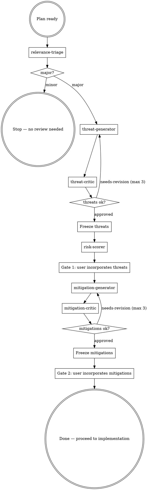

<SUBAGENT-STOP>
If you were dispatched as a worker subagent (relevance-triage, threat-generator,
threat-critic, risk-scorer, mitigation-generator, mitigation-critic), do the one
job you were given and return. Do NOT run this orchestration — you are part of it.
</SUBAGENT-STOP>

<EXTREMELY-IMPORTANT>
The moment an implementation plan is ready, and BEFORE you write any code, you
MUST run this review. Do not begin implementation until it finishes. If there is
even a 1% chance the change touches security, run it — triage decides minor vs.
major, you do not pre-judge it away.
</EXTREMELY-IMPORTANT>

# Security review loop

**Announce:** open with "Using ingrain-security to assess this plan."

You orchestrate **read-only** worker subagents from the main session
(`relevance-triage`, `threat-generator`, `threat-critic`, `risk-scorer`,
`mitigation-generator`, `mitigation-critic`). They cannot call each other — you
invoke them in order and hold the state between steps, passing each worker its
inputs (and, on revision rounds, the prior draft + the critic's issues to
address).

## Flow

## Steps — in strict order

0. **Triage** — invoke `relevance-triage` with the plan.
   - If the verdict is `minor`: state "no security review needed — minor change"
     and **stop here**. Do not invoke any other worker; proceed with implementation.
   - If the verdict is `major`: keep its **Surfaces** notes — you forward them to
     the generator in Step 1 — and continue to run the full cycle.
1. **Threats** — invoke `threat-generator` with the plan **and the triage Surfaces
   notes** (its starting points, not a ceiling) → threat list (`T1…`).
2. **Critique threats** *(loop, max 3)* — invoke `threat-critic`. On
   `needs-revision`, re-invoke `threat-generator` with the prior list + critique
   and repeat. Then **freeze** the threats.
3. **Risk score** — invoke `risk-scorer` with the frozen threats → per-threat
   0–100 (likelihood × impact) plus an overall plan score and criticality band.
4. **Ask user — incorporate findings (Gate 1).** Present the scored threats and
   ask, via AskUserQuestion, which findings to add into the implementation plan.
   The user is deciding whether a threat is worth acting on, so each option must
   let them understand the threat without re-reading the plan. For every threat,
   write the option `label` as the risk band + short title (e.g. `T3 · high —
   unauthenticated token refresh`) and the option `description` so it answers
   three things, in plain language:
   - **What can go wrong** — the concrete failure, drawn from the threat's
     Vector/Description (not a generic category).
   - **Why it matters** — the consequence if realized, grounded in the
     risk-scorer's impact and 0–100 score (e.g. what an attacker gains, what data
     or guarantee is lost).
   - **Local impact in the plan** — which specific part of *this* change the
     threat lands on (the component, file, or step from the plan), so the user
     sees where in their own work it bites.

   Order the options by risk score (highest first) and keep this set faithful to
   the frozen threats and scores — don't invent, soften, or re-score. Use
   `multiSelect: true` so the user can pick several.
   **Incorporate the accepted findings into the plan.** The selected threats then
   proceed to mitigation.
5. **Mitigate** — invoke `mitigation-generator` with the selected threats.
6. **Critique mitigations** *(loop, max 3)* — invoke `mitigation-critic`;
   re-invoke `mitigation-generator` on `needs-revision`. Then **freeze** the
   mitigations.
7. **Ask user — incorporate findings (Gate 2).** Present the mitigations and ask,
   via AskUserQuestion, which to add into the implementation plan. **Incorporate
   the accepted mitigations into the plan.** This is the last step — close with a
   one-line verdict, then proceed to implementation.

## Red flags — stop if you catch yourself thinking…

| Thought | Reality |
|---------|---------|
| "This change is obviously trivial, skip triage" | Triage decides minor/major, not you. Run it. |
| "I'll start coding while the review runs" | No implementation until the review finishes. |
| "Let me score risk before the threats are settled" | Never score before threats are frozen. |
| "I'll write mitigations for threats the user didn't pick" | Only the Gate 1 selections proceed to mitigation. |
| "The critic flagged issues but it's good enough" | Re-run the generator with the feedback (up to 3 rounds). |
| "This loop could keep improving forever" | Cap each critic loop at 3 rounds; surface what's unresolved. |

## Rules

- **Read-only review; writes only at the gates.** Workers use only Read/Grep/Glob
  and make no code changes. The process writes in exactly two places:
  **incorporating accepted findings into the implementation plan** at Gate 1 and
  Gate 2 (the plan file when in plan mode). It reflects only what the user
  accepted at the gates — never unreviewed or rejected findings.
- **Triage first.** Run the full cycle only when `relevance-triage` returns
  `major`; bias to `major` when uncertain.
- **No skipping / no reordering.** Never score before threats are frozen, never
  mitigate before Gate 1, never present mitigations before they are frozen.
- **Bounded loops.** Cap each critic loop at 3 rounds; surface anything left
  unresolved rather than looping forever or hiding it.
