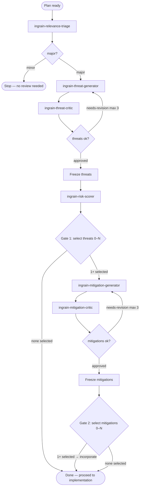

<SUBAGENT-STOP>
If you were dispatched as a worker subagent (ingrain-relevance-triage, ingrain-threat-generator,
ingrain-threat-critic, ingrain-risk-scorer, ingrain-mitigation-generator, ingrain-mitigation-critic), do the one
job you were given and return. Do NOT run this orchestration — you are part of it.
</SUBAGENT-STOP>

<EXTREMELY-IMPORTANT>
The moment an implementation plan is ready, and BEFORE you write any code, you
MUST run this review. Do not begin implementation until it finishes. If there is
even a 1% chance the change touches security, run it — triage decides minor vs.
major, you do not pre-judge it away.
</EXTREMELY-IMPORTANT>

# Security review loop

**Announce:** open with "Using ingrain-security to assess this plan."

You orchestrate six **read-only** worker skills, each at `skills/<name>/SKILL.md`
(`ingrain-relevance-triage`, `ingrain-threat-generator`, `ingrain-threat-critic`, `ingrain-risk-scorer`,
`ingrain-mitigation-generator`, `ingrain-mitigation-critic`). You dispatch each one as a fresh
subagent (see **How to dispatch a worker**), in order, holding the state between
steps yourself — workers cannot call each other or you. On revision rounds you
pass the worker its prior draft plus the critic's issues to address.

## How to dispatch a worker

A worker is a skill, not a platform-native agent. You never run a worker's logic
yourself — you dispatch a **fresh read-only subagent** and tell it to become that
worker by reading its skill. This keeps the review cross-platform: it works
wherever a subagent primitive exists, and degrades to sequential in-context
execution where one does not. See `references/platform-dispatch.md` for the
per-platform mapping (host with a subagent/task primitive → that primitive;
no-subagent fallback → sequential in-context execution).

Dispatch every worker with the same shape — restate the read-only constraint
inline, because on hosts without tool-level enforcement it is the only thing
enforcing it:

```
Read skills/<name>/SKILL.md and follow it as your system prompt.
You are read-only — use only Read/Grep/Glob and make no edits.
INPUT:
<the worker's inputs — the plan; on revision rounds, the prior draft + the
critic's itemized feedback>
Return only the Output section that skill specifies.
```

Branch on the keyword the worker leads its output with (`minor`/`major`,
`approved`/`needs-revision`). Thread each worker's result into the next dispatch
yourself; the subagents share no state.

## How to ask the user (the selection prompt)

Gate 1 and Gate 2 are **per-finding selection gates** — the user includes or
excludes each finding individually and may select any subset, **including
none**. Always do this in **two distinct steps, in this order**:

1. **Display the information first.** Before asking anything, present the full
   findings to the user as a **Markdown table** — one row per finding, with the
   columns the gate step specifies. The table is where the detail lives, so the
   user can read and compare every finding in one place before deciding.
2. **Then show the selection prompt.** Only after the table is displayed,
   present a **selection prompt** offering **one include/exclude choice per
   finding**, each labeled by its tag + short title (e.g. `T3 — unauthenticated
   token refresh`). Mark findings the `ingrain-risk-scorer` banded **high or
   critical** as recommended. This is a generic primitive — use whatever
   structured multi-select mechanism the host provides; do not assume any one
   platform's tool. See `references/platform-dispatch.md` for the per-platform
   mapping, including how to split when the host caps options per prompt and
   how to keep zero-selection reachable. **Never collapse the gate into a
   single yes/no over the whole set** — the user decides per finding.

Never fold the information into the prompt options alone — the table comes first,
the prompt second. The prompt's options reference the table (by finding tags)
rather than restating its full detail.

## Flow



## Steps — in strict order

0. **Triage** — dispatch the `ingrain-relevance-triage` worker with the plan.
   - If the verdict is `minor`: state "no security review needed — minor change"
     and **stop here**. Do not dispatch any other worker; proceed with implementation.
   - If the verdict is `major`: keep its **Surfaces** notes — you forward them to
     the generator in Step 1 — and continue to run the full cycle.
1. **Threats** — dispatch the `ingrain-threat-generator` worker with the plan **and the
   triage Surfaces notes** (its starting points, not a ceiling) → threat list (`T1…`).
2. **Critique threats** *(loop, max 3)* — dispatch the `ingrain-threat-critic` worker. On
   `needs-revision`, re-dispatch `ingrain-threat-generator` with the prior list + critique
   and repeat. Then **freeze** the threats.
3. **Risk score** — dispatch the `ingrain-risk-scorer` worker with the frozen threats →
   per-threat 0–100 (likelihood × impact) plus an overall plan score and criticality band.
4. **Ask user — select which threats to address (Gate 1).** Follow the two-step
   display-then-ask pattern (see **How to ask the user**). The user is deciding
   per threat whether it is worth acting on, so they must understand each
   threat without re-reading the plan.

   **First, display the scored threats as a Markdown table** — one row per threat,
   ordered by risk score (highest first), with these columns:

   | Column | Contents |
   |--------|----------|
   | **Threat** | tag + short title (e.g. `T3 — unauthenticated token refresh`) |
   | **Risk** | risk band + 0–100 score (e.g. `high · 78`) |
   | **What can go wrong** | the concrete failure, drawn from the threat's Vector/Description (not a generic category) |
   | **Why it matters** | the consequence if realized, grounded in the ingrain-risk-scorer's impact and score (what an attacker gains, what data or guarantee is lost) |
   | **Local impact in the plan** | which specific part of *this* change the threat lands on (the component, file, or step from the plan) |

   Keep the table faithful to the frozen threats and scores — don't invent,
   soften, or re-score. Flag rows whose risk band is high or critical (e.g.
   `⚑ high · 78` in the Risk column) — these are the ones you mark recommended
   in the selection prompt, so the table and the prompt tell the same story.

   **Then show the selection prompt** asking which threats to address, with one
   include/exclude choice per threat. Each option's `label` is the threat's tag
   + short title (e.g. `T3 — unauthenticated token refresh`); mark high/critical
   threats as recommended. The user may include any subset, including none.

   - **1–N selected** — incorporate the selected threats into the plan; only
     they proceed to mitigation. Name the excluded ones in one line (e.g. "T2,
     T5 excluded — risk accepted").
   - **None selected** — incorporate nothing, skip Steps 5–7, state "no threats
     selected — review closed" and close with a one-line verdict naming the
     threats as accepted risk, then proceed to implementation.
5. **Mitigate** — dispatch the `ingrain-mitigation-generator` worker with the
   user-selected threats — only those; excluded threats are out of scope.
6. **Critique mitigations** *(loop, max 3)* — dispatch the `ingrain-mitigation-critic`
   worker; re-dispatch `ingrain-mitigation-generator` on `needs-revision`. Then **freeze**
   the mitigations.
7. **Ask user — select which mitigations to adopt (Gate 2).** Follow the
   two-step display-then-ask pattern (see **How to ask the user**).

   **First, display the frozen mitigations as a Markdown table** — one row per
   mitigation, with these columns:

   | Column | Contents |
   |--------|----------|
   | **Mitigation** | short title of the proposed mitigation |
   | **Addresses** | the threat tag(s) it covers (`T1`, `T3`, …) |
   | **What it does** | the task-specific guidance, from the mitigation's Description |
   | **Yield** | the risk it removes over the current baseline |
   | **Effort** | how much work it takes to implement |

   Keep the table faithful to the frozen mitigations — don't invent or re-scope.

   **Then show the selection prompt** asking which mitigations to adopt, with
   one include/exclude choice per mitigation, each option labeled by the
   mitigation's short title + the threat tag(s) it addresses. The user may
   include any subset, including none.

   - **1–N selected** — incorporate exactly the selected mitigations into the
     plan. If the selection leaves a selected threat with no covering
     mitigation, say so in the closing verdict — never silently.
   - **None selected** — incorporate nothing; note that the selected threats
     remain unmitigated.

   This is the last step — close with a one-line verdict, then proceed to
   implementation.

## Red flags — stop if you catch yourself thinking…

| Thought | Reality |
|---------|---------|
| "This change is obviously trivial, skip triage" | Triage decides minor/major, not you. Run it. |
| "I'll start coding while the review runs" | No implementation until the review finishes. |
| "Let me score risk before the threats are settled" | Never score before threats are frozen. |
| "I'll write mitigations even though the user selected zero threats" | Zero threats selected at Gate 1 ends the review — nothing proceeds to mitigation. |
| "I'll make the gate one yes/no over the whole set" | Each gate is a per-finding selection — the user includes or excludes each finding individually (zero is allowed). |
| "The user excluded T2, but it's important — I'll mitigate it anyway" | Excluded findings are out of scope. Record them as accepted risk and move on. |
| "The critic flagged issues but it's good enough" | Re-run the generator with the feedback (up to 3 rounds). |
| "This loop could keep improving forever" | Cap each critic loop at 3 rounds; surface what's unresolved. |
| "I'll just answer the worker's job myself instead of dispatching" | Each worker runs in its own read-only subagent — dispatch it, don't inline it. |
| "I'll put all the detail in the prompt options and skip the table" | Display the findings as a table first, then show the selection prompt — never the prompt alone. |

## Rules

- **Read-only review; writes only at the gates.** Workers are dispatched as
  read-only subagents (Read/Grep/Glob only) and make no code changes — restate
  that constraint in every dispatch, since without tool-level enforcement it is
  advisory. The process
  writes in exactly two places: **incorporating the user-selected finding set
  into the implementation plan** at Gate 1 and Gate 2 (the plan file when in
  plan mode). Each gate incorporates exactly the selected subset — never an
  unselected or unreviewed finding. Zero selections at Gate 1 end the review;
  zero selections at Gate 2 incorporate nothing.
- **Triage first.** Run the full cycle only when `ingrain-relevance-triage` returns
  `major`; bias to `major` when uncertain.
- **No skipping / no reordering.** Never score before threats are frozen, never
  mitigate before Gate 1, never present mitigations before they are frozen.
- **Bounded loops.** Cap each critic loop at 3 rounds; surface anything left
  unresolved rather than looping forever or hiding it.
