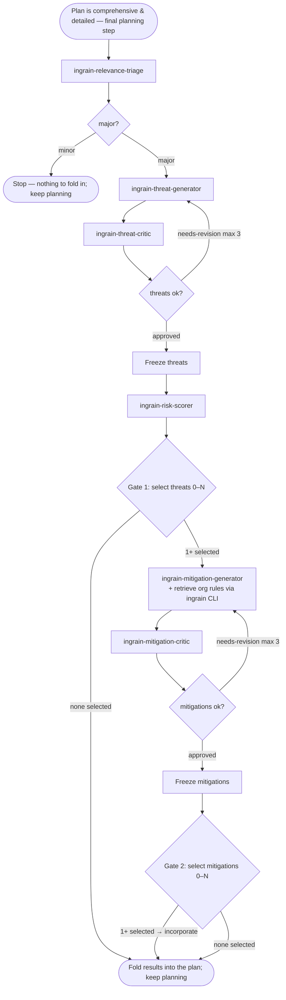

<SUBAGENT-STOP>
If you were dispatched as a worker subagent (ingrain-relevance-triage, ingrain-threat-generator,
ingrain-threat-critic, ingrain-risk-scorer, ingrain-mitigation-generator,
ingrain-mitigation-critic, ingrain-threat-verifier), do the one job you were given
and return. The orchestration — Development and Testing alike — is run by the session that
dispatched you; you are one step inside it.
</SUBAGENT-STOP>

<EXTREMELY-IMPORTANT>
Security analysis is the FINAL step of planning. Build the plan in full first — affected files,
concrete implementations, tests. The trigger is that *state*, reached alike by an **ad-hoc plan**
worked out inline and a **formal planning session** (plan mode, a design doc): detailed plan,
implementation still ahead. Run the review there, before you present it or write any code, then
fold its results back into the plan. At a 1% chance of touching security, run it — triage decides
minor vs. major.
</EXTREMELY-IMPORTANT>

## Phase select — do this FIRST

Two phases. **Development — plan review** is the flow below: it runs on a finished plan, before
code. **Testing — verification** (`references/testing/verification-pass.md`) runs on the code that
plan produced. Decide which from repo state, before anything else.

**If the user named a phase, that is the answer.** "Verify the mitigations" → **Testing**.
"Review this plan" → **Development**. Skip the cases below.

Otherwise **issue all three bundled scripts in ONE block** — read-only, deterministic and mutually
independent, so together they cost a single round-trip. Your SessionStart context carries each one
ready to run (plugin root and host already substituted):

    bash <plugin>/skills/ingrain-security/scripts/assessment-path <host> mint --title "<task title>"
    bash <plugin>/skills/ingrain-security/scripts/rules-path <host> mint --title "<same title>"
    bash <plugin>/skills/ingrain-security/scripts/branch-diff <host>

Keep `assessment_abs`, `rules_abs`, `branch_slug`, `file_exists`, `base_ref`, `diff_ref`,
`delta_empty` and `fallback` from that one batch and **reuse them for the whole run** — no step
below re-mints anything. Obey each script's `instruction` field.

- **`assessment_abs`** — the absolute path — is the write target for every worker dispatch, every
  Write/Edit, and finalize. The relative `assessment_path`
  (`.ingrain-security/assessment-<branch-slug>-<task-slug>.md`) is a **display form** only: prose,
  tables and plan-file links.
- **`file_exists` reports written content, not presence.** The mint seeds an empty skeleton, so it
  stays `false` until a stage fills a section — which is what keeps it usable as the signal.
- **`delta_empty: false`** means commits since the fork point, an uncommitted change, or both.
  → `references/lib/branch-diff.md` owns the refs and why this, not `git status`, is the signal.

If `file_exists: true`, read the bounded `## Mitigations` slice of that file. Then take the **first
matching case**:

1. **`file_exists: false`** → **Development.** No assessment for this task; start at triage.
2. **`file_exists: true`, no `selected` mitigation rows** → **Development.** Resume this task's
   analysis in place.
3. **`file_exists: true`, 1+ `selected` rows, `delta_empty: true`** → **Development.** The plan was
   reviewed; the implementation is still ahead.
4. **`file_exists: true`, 1+ `selected` rows, `delta_empty: false`** → **Testing.** Read
   `references/testing/verification-pass.md` NOW.

**Case 4 is the only Testing route, and it needs all three signals at once: this task's assessment,
adopted mitigations in it, a non-empty branch delta. Cases 1–3 are all Development.**

How to classify three less-obvious repo states. Verdict first, then why:
- **A branch delta with no assessment for this task → Development, case 1.** A fresh task on a
  branch already carrying unrelated commits or WIP mints a fresh path, so `file_exists: false`; a
  delta alone is never a Testing signal. The mint is keyed on branch **+ task title**, binding an
  assessment to one task — so take `file_exists` at its word rather than globbing the folder, which
  surfaces another task's file.
- **`Latest stage: testing`, delta grown since → Testing again, case 4.** It records that a
  verification ran, not that the task is closed: re-test every selected threat, overwriting
  `Robustness` and `Justification`.
- **A `minor` triage → Development, case 2** — nothing was adopted, so nothing to verify.
  An explicit request sends you to Testing, which stops at "no adopted mitigations to verify";
  otherwise case 2 resumes Development and triage re-confirms `minor`. Either way the run ends at
  triage, which is right for a minor change.

Announce the phase you picked in your opening line, so a misroute costs the user one turn.

# Security review loop

**Announce:** open with "Using ingrain-security to assess this plan."

You orchestrate six worker roles, each defined by a reference file at
`references/development/<name>.md` (`ingrain-relevance-triage`, `ingrain-threat-generator`,
`ingrain-threat-critic`, `ingrain-risk-scorer`, `ingrain-mitigation-generator`,
`ingrain-mitigation-critic`). You dispatch each as a fresh subagent, in order, holding the state
between steps yourself. One step is yours alone: the org-rules retrieval at Step 5, after Gate 1.

The process produces exactly **two things**: the **assessment file** (the hand-off medium the
workers write section by section, and you finalize) and the **user-selected finding set folded
into the plan** at Gate 1 and Gate 2.

**Context-window discipline:** hold only the compact statuses and pointers workers return, and
read a bounded slice of the assessment file at the two gates and at finalize — those bounded reads
are the whole of what the analysis costs your context. The file is the shared state, so you move
data between workers by pointing them at its sections and letting each read for itself.

**The one carve-out is Step 5's retrieval**, where the CLI's rule bodies land in your context
because you are the one writing them to the sidecar. That is the *only* bulk payload you handle
directly: write it straight through and then carry the sidecar's **path**, letting every later
reader open it.

## How to dispatch a worker

A worker is a role a fresh subagent adopts by reading its reference file. Dispatch a **fresh
worker subagent** and tell it to become that worker; the reference file is its logic. **This skill
is built for an agent-based host — one fresh subagent per worker is the designed and expected mode**,
because that is what gives each worker clean context and its own recommended model tier.
→ `references/development/dispatch.md` maps this onto your host (subagent/task primitive, or the
sequential in-context fallback where none exists), and carries the rule that independent calls go
out in **one block**. Where a **session rule says** subagent dispatch waits on the user's request,
treat it as a permission gate over a mechanism the host already has: **ask the user to allow the
subagent flow before your first dispatch** →
`references/development/dispatch.md` § When a session rule gates subagents behind user request.

**Every change to the assessment file goes through the Edit or Write tool**, and **a write is one
call** — one Write or Edit per section, one Edit per *entry* where fields are being filled in.
→ `references/development/dispatch.md` § Writing the assessment file owns the rest.

Dispatch every worker with the same shape — restate its write target inline, because that path is
per-run and the worker has no other way to learn it:

```
Read references/development/<name>.md and follow it as your system prompt.
You do no code or repo edits — use only Read/Grep/Glob on the codebase. Your ONE
permitted write is your own section of the stored analysis file for this run at
<the minted assessment_abs — the ABSOLUTE path, pasted in full> (section: <## Section for this worker>),
written to the schema in references/assessment-file.md — use exactly its fields and
enum values. Write to that exact absolute path: never shorten it, never resolve it
against a file you happen to be reading, and never create an ingrain-security/ folder
yourself — the one for this repo already exists.
Scope tightly: include only findings genuinely relevant to THIS plan — if an item
would not change how this specific change is reviewed or implemented, omit it.
INPUT:
<the finished, detailed implementation plan; plus POINTERS to the sections this
worker must read — e.g. "read <the run's assessment file> § Threats and
§ Threat critique" — on the revision round, the pointer to the prior draft's section +
the critic's itemized feedback>
Write your full Output into your section of the assessment file, then RETURN ONLY:
your branch keyword (minor/major, approved/needs-revision) or headline result, plus
a one-line pointer to the section you wrote, which carries the full output.
```

Branch on the keyword the worker leads its return with (`minor`/`major`,
`approved`/`needs-revision`), and pass the **next** worker a pointer to the sections it must read.

**Model:** set each worker's model from the **Recommended model** line in its own reference file.
You stay on the session model. Host-dependent — ignore where per-subagent model selection is
unsupported.

### The three-check

**Check what was written against its field card — never by re-reading the schema.** Three things,
and nothing else:

1. every field label present, in the order the card lists;
2. every enumerated value one of the words the card names, verbatim;
3. every field whose stage has not run yet still `—`.

**It costs no read of its own.** Run it on the reads you already make — the bounded `## Threats`
slice at Gate 1, the bounded `## Mitigations` slice at Gate 2, and the finished file at finalize.
Each sits upstream of everything that consumes the section, so a malformed entry is cheapest to
repair there: re-dispatch the worker that produced it with the problem quoted back.

**One exception to the read-only constraint:** the `ingrain-mitigation-generator`
is additionally allowed to run the read-only `ingrain context security_rules
"<query>"` CLI lookup to fetch the org's security rules — dispatch it with the
Bash/exec tool available in addition to Read/Grep/Glob, and say so in its
dispatch. It still makes no edits and runs no other commands. **Every other
worker stays strictly Read/Grep/Glob.** If the CLI is genuinely unavailable or
unconfigured, the generator degrades gracefully and proceeds without rules. But a
**sandbox / permission denial is recoverable** — the generator first relies on the
host's native "allow this command?" prompt to the user, and where it cannot surface
one it returns a `fetch blocked — permission needed` signal so **you** ask the user
for access and re-dispatch it (see **On a `fetch blocked` signal** under step 5, and
`references/platform-dispatch.md`).

## Model tiers

1. **Display the findings as a Markdown table** — one row per finding, columns per the gate step.
   The table is where the detail lives, so the user compares every finding in one place before
   deciding. **Mandatory in every mode and on every host** — plan mode, ad-hoc, windowed or
   fallback alike. Printing it is a read-only display action, permitted in every mode.
2. **Then present the selection windows** — one single-choice include/exclude window per finding,
   labeled by id + short title (e.g. `T01 — unauthenticated token refresh`). One window, one
   finding, one binary choice keeps every decision isolated. Mark high/critical findings
   recommended; because each window is its own decision, **selecting none is always reachable**.
   → `references/development/dispatch.md` § Selection windows for the host mechanism and the
   batching rule where a host caps how many windows it can show at once.

## Development — the flow

Each step is one dispatch; you hold the state between them. The tracker is **Development —
checklist** at the end of this file.

0. **Triage** — dispatch `ingrain-relevance-triage` with the plan, the resolved `branch_slug` (or
   `unknown`), the task title, and the **absolute** `<project_root>/.ingrain-security/` folder from
   the mint JSON (a relative folder silently matches nothing and would wrongly report `none`).
   → `references/development/ingrain-relevance-triage.md` defines it; you branch on its keyword.
   - `minor` → state "no security review needed — minor change" and **STOP**. Triage is the whole
     pipeline for a minor change; carry on building the plan.
   - `major` → keep its **Surfaces** notes and any **Prior analysis pointer** for Step 1, then
     **open the assessment file** at `assessment_abs` — the mint already seeded its title, banner
     and every empty section, so fill the `## Task` fields in place rather than writing the page
     over. The worker's `## Triage` section is already in it.

1. **Display the information first.** Before asking anything, present the full
   findings to the user as a **Markdown table** — one row per finding, with the
   columns the gate step specifies. The table is where the detail lives, so the
   user can read and compare every finding in one place before deciding.
   **Displaying the table is mandatory in every mode and on every host** — plan
   mode, ad-hoc, windowed or fallback selection alike. It is rendered as
   **visible output in the conversation**, never only written into the plan or
   assessment file, and never skipped as "extra output": printing it is a
   read-only display action that no mode forbids. To build it, **read the
   bounded gate slice of the assessment file** (`## Threats` at Gate 1,
   `## Mitigations` at Gate 2) — this read is **required**, and it is exactly
   the read the context-window discipline permits. If the slice is empty or
   missing, stop and re-dispatch the worker that owns it rather than skipping
   the table or rendering it empty. In the
   same message, **name the plan file** these decisions feed into (in plan mode,
   the active plan-file path, e.g. `.${coding_agent_root}/plans/<name>.md`; ad-hoc, the inline
   plan you are building — see **The plan file**), so the user sees where the
   selected findings will land, **and name the run's assessment file** (its
   `ingrain-security/assessment-<branch-slug>-<task-slug>.md` path) so the user knows the full
   analysis backing the table lives there. These are a **mention only** — nothing is
   written to the plan file at the gates; the write happens at finalize.
2. **Then present the selection windows.** Only after the table is displayed,
   present the findings as **multiple single-choice windows — one window per
   finding** — each a single **include/exclude** decision labeled by its tag +
   short title (e.g. `T1 — unauthenticated token refresh`). One window, one
   finding, one binary choice keeps every decision isolated and deliberate, so
   findings never blur together the way they do in a single multi-toggle list.
   Mark findings the `ingrain-risk-scorer` scored **high or critical** as
   recommended. Where the host caps how many windows it can show at once,
   present them in **consecutive batches in table order** — tags ascend as
   priority descends, so this is `T1, T2, …` (and `M1, M2, …`), most important
   first — and merge the choices. Because each window is its own include/exclude
   decision, **selecting none is always reachable** — the user simply excludes
   every window. This is a generic primitive; do not assume any one platform's
   tool. See `references/platform-dispatch.md` for the per-platform mapping.
   **Never collapse the gate into a single yes/no over the whole set, and never
   fold all findings into one combined list** — one window per finding, and the
   user decides each one.

2. **Critique the threats** *(single round)*.

   - **Dispatch `ingrain-threat-critic`** at `## Threats`, then act on its keyword:
   - `needs-revision` → re-dispatch `ingrain-threat-generator` **once**, with a pointer to
     `## Threats` + `## Threat critique`, then **freeze**. That single revision closes the loop.
   - `approved` → **freeze** the threats.
   - Either way, surface anything the critique left unresolved.

3. **Risk score** — dispatch `ingrain-risk-scorer` at the frozen `## Threats`. It fills each
   entry's five scoring field lines, writes the plan-level residual into `## Risk score`, and
   **re-tags the threats into descending-risk order** — reordering the entries and reassigning ids
   contiguously from `T01`, the most dangerous threat. It is the last stage that can do so safely:
   threat ids pick up their first references at Step 6, when mitigations name them. From here
   **the id is the priority** and is permanent: every stage that shows threats shows them in
   **id order** — the ids are the sort.

The review persists its analysis to a **single file written directly into
`ingrain-security/`** at the project root — it is both the living working copy the workers
write during the run and its persisted record, so there is **no separate temp file and no
finalize copy**. **Do not hand-build its path.** Mint it once, at the start of the review,
by running the bundled **`scripts/assessment-path`** script and reuse its output
everywhere. Your SessionStart context carries the concrete, ready-to-run command (plugin
root and host already substituted); it takes the form:

    bash <plugin>/skills/ingrain-security/scripts/assessment-path <host> mint --title "<task title>"

The script returns a JSON object. Use its **`assessment_abs`** — the **absolute** path —
verbatim as the file path for every worker dispatch, every Write/Edit, and at finalize, and
obey the `instruction` field it carries. The relative `assessment_path` is a **display form**
only: put it in prose, tables and plan-file links, never in a write target. This distinction
is the whole guard against a stray `ingrain-security/` folder being created next to whatever
file an agent is editing — a relative path is resolved by whoever receives it, and a worker
subagent has no way to know the project root. The script resolves the root from the git repo,
creates the one folder, and hands you the finished absolute path; there is nothing to rebuild.

The path is deterministic in the branch + task:

    <project_root>/ingrain-security/assessment-<branch-slug>-<task-slug>.md

so it doubles as the task's identity — re-reviewing the **same task on the same branch**
resolves to the **same file** (the run resumes/updates it in place; `file_exists: true`
signals this), while a different task or branch gets its own file. This task-slug keying is
**by design how two concurrent tasks on one branch stay isolated**: distinct titles mint
distinct files, so parallel reviews never write over each other — the separation is
structural, not left to a worker's judgement. The `assessment-` prefix
always leads; any unresolvable segment is dropped (no branch → `assessment-<task-slug>.md`;
no title → `assessment-<branch-slug>.md`; both → `assessment.md`). The file is
**git-ignored** (the folder self-ignores), so it stays uncommitted. It is a
**living document** and the **hand-off medium** between workers:
each worker writes its own named section, the orchestrator frames and finalizes it, and the
plan you produce links it and carries the **Maintenance** instruction for the implementing
agent.

**The script resolves the current branch once** and returns it as `branch_slug` (with a
`branch_known` flag). Under the hood it uses `git branch --show-current` (fallback
`git rev-parse --abbrev-ref HEAD`, never `.git/HEAD`), lowercased and reduced to
`[a-z0-9-]`; a detached HEAD or non-git checkout yields an **unknown** branch, which drops
the `<branch-slug>-` segment and tells triage the branch is unknown (see Step 0). Running
the script is the orchestrator's one shell call.

Its **section layout and content template are defined in
`references/assessment-file.md`** — follow that reference exactly, so every enumerated
field (`impact`, `likelihood`, `criticality`, `yield`, `effort`, and the Gate
selection `selected`/`excluded`/`undecided`) uses exactly the values it lists.

## The plan file

The review folds its results into **the plan file** — the implementation plan the
coding agent edits and executes downstream. This is **distinct from the assessment
file**: the assessment file (`ingrain-security/assessment-<branch-slug>-<task-slug>.md`) is the security-analysis
artifact the workers write; the plan file is the implementation plan the selected
threats and adopted mitigations become part of.

In **plan mode** it is a concrete on-disk file (e.g. `.${coding_agent_root}/plans/<name>.md`); you
already hold its path, since it is the file you are editing — **name it** when you
reference it. In **ad-hoc mode** there is no file — the plan file is "the inline plan
you are building" in the conversation. Reference the plan file at both gate displays
(mention only — see **How to ask the user**) and write the results into it at finalize.

## Flow


```mermaid
flowchart TD
    planning([Plan is comprehensive & detailed — final planning step]) --> triage[ingrain-relevance-triage]
    triage --> majorQ{major?}
    majorQ -->|minor| stop([Stop — nothing to fold in; keep planning])
    majorQ -->|major| threatGen[ingrain-threat-generator]

    threatGen --> threatCritic[ingrain-threat-critic]
    threatCritic --> threatsOk{threats ok?}
    threatsOk -->|needs-revision max 3| threatGen
    threatsOk -->|approved| freezeThreats[Freeze threats]

    freezeThreats --> riskScorer[ingrain-risk-scorer]
    riskScorer --> gate1{Gate 1: select threats 0–N}
    gate1 -->|none selected| done([Fold results into the plan; keep planning])
    gate1 -->|1+ selected| mitGen[ingrain-mitigation-generator<br/>+ retrieve org rules via ingrain CLI]

    mitGen --> mitCritic[ingrain-mitigation-critic]
    mitCritic --> mitsOk{mitigations ok?}
    mitsOk -->|needs-revision max 3| mitGen
    mitsOk -->|approved| freezeMits[Freeze mitigations]

    freezeMits --> gate2{Gate 2: select mitigations 0–N}
    gate2 -->|1+ selected → incorporate| done
    gate2 -->|none selected| done
```

Throughout the flow, each worker writes its own section of **the run's assessment
file** (the `assessment_abs` you minted) and you pass the next worker a pointer to the
sections it needs — the file is the shared state, so your own context stays lean.

## Steps — in strict order

0. **Triage** — dispatch the `ingrain-relevance-triage` worker with the plan, **plus the
   resolved `<branch-slug>` (or "unknown") and the task title**. Instruct it to first
   **check for a prior analysis** of this task in the assessment folder — pass it the
   **absolute** folder, `<project_root>/ingrain-security/`, from the mint JSON, so its
   Glob cannot drift (matching on branch + task title — a shared branch may
   hold other concurrent tasks' assessments, so a loose match returns `none`) before it
   classifies — per `references/ingrain-relevance-triage.md`. If it finds a prior snapshot whose
   `## Threats` are non-empty, it returns a **Prior analysis** pointer (path + threat
   count) alongside its verdict; keep that pointer to forward to the generator in Step 1.
   - If the verdict is `minor`: state "no security review needed — minor change"
     and **stop here**. Do not dispatch any other worker; there is nothing to fold
     into the plan — carry on building it.
   - If the verdict is `major`: keep its **Surfaces** notes — you forward them to
     the generator in Step 1 — and continue to run the full cycle. **Create or open the
     assessment file** at the minted `assessment_abs` (see **The assessment file**;
     `file_exists: true` means you are resuming this task's prior analysis) with its title +
     banner and the `## Task` section; the triage worker's `## Triage` section
     (verdict + Surfaces) is now in it. This is the hand-off medium for every step
     that follows — its schema and template live in `references/assessment-file.md`.
1. **Threats** — dispatch the `ingrain-threat-generator` worker, pointing it at the plan
   **and the `## Triage` section** (Surfaces are starting points, not a ceiling).
   **If triage returned a Prior analysis pointer**, also point the generator at that prior
   snapshot's `## Threats` (and `## Mitigations`) so it **seeds from the prior analysis**
   rather than starting from scratch — re-derive and refresh against the current plan, do
   not blindly copy. It writes
   the threat rows (descriptive columns, `T1…`; most tasks warrant 3–6 rows — a target, not a hard cap) into the `## Threats` table per the
   `references/assessment-file.md` schema and returns a pointer.
2. **Critique threats** *(loop, max 3)* — dispatch the `ingrain-threat-critic` worker,
   pointing it at the `## Threats` section. On `needs-revision`, re-dispatch
   `ingrain-threat-generator` with a pointer to `## Threats` + `## Threat critique` and
   repeat. Then **freeze** the threats (the frozen list lives in the `## Threats` section).
3. **Risk score** — dispatch the `ingrain-risk-scorer` worker, pointing it at the frozen
   `## Threats` section. It fills each row's scoring columns (Justification, Impact,
   Likelihood, Risk score 0–100, Criticality) and writes the plan-level residual risk into
   `## Risk score` — per the `references/assessment-file.md` schema.
4. **Ask user — select which threats to address (Gate 1).** Follow the two-step
   display-then-ask pattern (see **How to ask the user**). The user is deciding
   per threat whether it is worth acting on, so they must understand each
   threat without re-reading the plan.

   **First, display the scored threats as a Markdown table in the conversation** —
   always, in every mode (plan mode included) — one row per threat,
   ordered by risk score (highest first), with these columns:

   | Column | Contents |
   |--------|----------|
   | **Threat** | tag + short title (e.g. `T3 — unauthenticated token refresh`) |
   | **Risk** | risk criticality + 0–100 score (e.g. `high · 78`) |
   | **What can go wrong** | the concrete failure, from the threat's Vector/Description, in this change's terms |
   | **Why it matters** | the consequence if realized, grounded in the scorer's impact and score |
   | **Local impact in the plan** | which specific part of *this* change the threat lands on |

   Keep the table faithful to the frozen threats and scores — don't invent,
   soften, or re-score. Flag rows whose risk criticality is high or critical (e.g.
   `⚑ high · 78` in the Risk column) — these are the ones you mark recommended
   in the selection windows, so the table and the windows tell the same story.
   In the same message, **name the run's assessment file** (its
   `ingrain-security/assessment-<branch-slug>-<task-slug>.md` path) so the user can open the full
   analysis behind the table, alongside the plan file mention (see **How to ask
   the user**).

   - **1–N selected** → only those proceed to Step 5. Name the excluded in one line
     ("T02, T05 excluded — risk accepted").
   - **None selected** → skip Steps 5–8. State "no threats selected — review closed", close with a
     one-line verdict naming the threats as accepted risk, then **go to Finalize** — the
     all-`excluded` `## Threats` section is the preserved context. Then carry on planning.

5. **Retrieve the org rules — yours alone, no worker.** Reached only when Gate 1 selected 1+
   threats (a zero-selection Gate 1 has already gone to Finalize). They are ingested knowledge —
   how *this* team implements auth, validation, secrets, crypto — reached by semantic search over
   the `ingrain` CLI, and this is the review's **one** retrieval pass. It keys on the
   **user-selected threats only**: probe the CLI, reason from the plan and the selected threats
   about which security features need org guidance ("how do we authenticate service-to-service
   calls"), and run one query per distinct question. Write what comes back — id, title and **full
   body verbatim** — into `## Retrieved rules` at the already-minted `rules_abs`. Nothing retrieved
   → leave the sidecar unwritten. **This step blocks Step 6** — the mitigation generator reads
   these rules.
   → `references/lib/ingrain-cli.md` owns the probe, the query and the failure taxonomy;
   `references/formatting/rules-file.md` owns the sidecar's schema.

   To build the table, read only the bounded `## Threats` slice of the assessment
   file — not the whole running analysis. This read is **required**, not a
   context-discipline violation. Every table cell and every window label comes
   from that slice; if the slice is empty or its scoring columns are unfilled,
   stop and re-dispatch the `ingrain-risk-scorer` (or the `ingrain-threat-generator` if the
   rows themselves are missing) rather than skipping the table or rendering it
   empty. **After the user decides, record each
   threat's `Selection`** in the `## Threats` table (include → `selected`, exclude →
   `excluded`; `undecided` only if the user is explicitly unsure), per the
   `references/assessment-file.md` schema.

   - **1–N selected** — incorporate the selected threats into the plan; only
     they proceed to mitigation. Name the excluded ones in one line (e.g. "T2,
     T5 excluded — risk accepted").
   - **None selected** — incorporate no mitigations, skip Steps 5–7, state "no threats
     selected — review closed" and close with a one-line verdict naming the
     threats as accepted risk. Still **fold the assessment link + maintenance
     instruction into the plan** (the `## Threats` section, with every threat marked
     `excluded`, is the preserved context) and **delete the `## Threat critique`
     section** (iteration scratch). The assessment file already lives at its
     `ingrain-security/assessment-<branch-slug>-<task-slug>.md` path — no snapshot copy is
     needed — so just finalize it in place, then continue building the plan.
5. **Mitigate** — dispatch the `ingrain-mitigation-generator` worker with the
   user-selected threats — only those; excluded threats are out of scope. It proposes
   both **threat mitigations** (covering the selected threats) and **general
   implementation instructions** for the full scoped task that are not tied to a single
   threat — both belong in the mitigation plan. As part
   of this step the generator retrieves the org's **security rules** — authoritative
   guidance on *how to implement* the needed security features — by running
   `ingrain context security_rules "<query>"`, and folds them into its proposals so
   the mitigations reflect established org practice, not just generic advice. If the
   CLI is unavailable or unconfigured it degrades gracefully and proceeds without
   rules. If instead the rule fetch is **blocked by the sandbox / permission layer**,
   the generator asks for access via the host's native prompt or signals back so you
   can prompt and retry (see **On a `fetch blocked` signal** below) — a permission
   denial is not silently dropped. The generator records **compact Rule refs (rule
   ids)** on each mitigation row of `## Mitigations` — persisted and part of the plan,
   but **never shown to the user** — **plus** the fuller rule detail (titles, bodies,
   applicable rules) in the transient `## Org rules` section, where the critic reads it.
   Gate 2 renders each mitigation's rule **titles** from that transient section; it is
   deleted at finalize.

   **On a `fetch blocked` signal.** If the generator returns
   `fetch blocked — permission needed` (its `ingrain context` lookup was denied by the
   sandbox and it could not surface a permission prompt itself), do **not** accept the
   review without org rules yet. **Ask the user for permission** to run the org-rules
   fetch — using the host's selection-window / question primitive, the same one the
   gates use (see **How to ask the user** and `references/platform-dispatch.md` →
   **Selection windows**). On grant, **re-dispatch the `ingrain-mitigation-generator`**
   with exec access granted so the fetch can complete. Only if the user **declines**
   (or no permission channel exists) do you let it proceed with graceful degradation —
   note that no org rules were retrieved because access was declined.
6. **Critique mitigations** *(loop, max 3)* — dispatch the `ingrain-mitigation-critic`
   worker, pointing it at `## Mitigations` **and the transient `## Org rules` section**
   (so it can judge the mitigations against the rules they cite); re-dispatch
   `ingrain-mitigation-generator` on `needs-revision`. Then **freeze** the mitigations.
7. **Ask user — select which mitigations to adopt (Gate 2).** Follow the
   two-step display-then-ask pattern (see **How to ask the user**).

   **First, display the frozen mitigations as a Markdown table in the
   conversation** — always, in every mode (plan mode included) — one row per
   mitigation, with these columns:

   | Column | Contents |
   |--------|----------|
   | **Mitigation** | short title of the proposed mitigation |
   | **Addresses** | the threat id(s) it covers (`T01`, `T03`, …), or `— (general)` |
   | **What it does** | the task-specific guidance, from the mitigation's Description |
   | **Yield** | the risk it removes over the current baseline |
   | **Effort** | how much work it takes to implement |
   | **Follows rules** | the **title(s)** of the org rule(s) it follows, resolved from that mitigation's entry in the sidecar (e.g. `Authenticated service calls`); `—` for a pure threat mitigation |

   Keep the table faithful to the frozen mitigations — don't invent or re-scope.
   The **Follows rules** column names the rules by **title**: for each id in the
   mitigation's **Rule refs**, take the title from its `M<n> → "<title>" (<id>)` citation
   in `## Org rules`. The rule **ids** stay in the persisted **Rule refs** column of
   `## Mitigations` — machine-facing, never shown to the user. The rule **bodies** stay in
   `## Org rules` and are deleted at finalize. If a **Rule ref** id has no matching
   citation, no title is available: print the mitigation's rule count (e.g. `2 org rules`)
   rather than falling back to the id.

   **Then present one single-choice window per mitigation** asking which
   mitigations to adopt — each window a single include/exclude decision for that
   mitigation, labeled by its short title + the threat tag(s) it addresses (or
   `general` when it addresses no specific threat).
   Where the host caps how many windows show at once, batch them in table order.
   The user may include any subset, including none (exclude every window).

## The plan file

   **Finalize the assessment file in place:** record each mitigation's `Selection` in the
   `## Mitigations` table (adopt → `selected`, decline → `excluded`), and fill
   `## Coverage / open items` with any `selected` threat left without a `selected`
   covering mitigation — per the `references/assessment-file.md` schema. Then
   **delete the three transient sections — `## Threat critique`, `## Mitigation critique`,
   and `## Org rules`** (heading and body) — they are iteration scratch; the finalized
   file carries only end results and matches the schema template. Write to the minted
   `assessment_abs`; the file already lives there, so there is **no snapshot to copy** —
   finalizing it *is* persisting it.

   Then **write the results into the plan file** (see **The plan file**) — the
   implementation plan the coding agent edits and executes. Incorporate the selected
   threats and adopted mitigations, and fold in two supporting things: (1) a link to
   the run's assessment file — use the **relative** `assessment_path` here, because a
   plan file outlives the absolute path and stays valid after a clone or move — noting
   that it is git-ignored by default (share it with `git add -f <file>`); and (2) the
   maintenance instruction — tell the implementing agent to keep that file in sync as
   the implementation changes across iteration loops, and to locate it by **re-running
   the `assessment-path` mint command** from its `INGRAIN-ASSESSMENT-PATHS` session
   context and writing to the `assessment_abs` it returns. Never tell it to write to the
   relative link: that agent runs in a later session with no project root in view, and it
   will resolve the path against whatever file it is editing, creating a stray
   `ingrain-security/` folder there. Re-minting is deterministic in branch + title, so it
   resolves to the same file. In plan mode, **name the plan
   file you write to** (e.g. `.${coding_agent_root}/plans/<name>.md`); ad-hoc, this is the inline
   plan you are building.

## Finalize

Reached from Gate 1 (none selected) or Gate 2. Two writes:

**1. Finalize the assessment file in place.** Fill `## Coverage / open items` with any `selected`
threat left without a `selected` covering mitigation, and set `## Task` →
`Latest stage: development`. Then **delete the two transient sections — `## Threat critique` and
`## Mitigation critique`** (heading and body): they are iteration scratch. **Leave every field card
where it is, and leave the `rules-<…>.md` sidecar in place** — both are persistent artifacts the
Testing pass reads in a later session. One write, to `assessment_abs`; the file already lives at
its final path, so finalizing it in place *is* persisting it.

**Run the three-check over the finished file** on the read this step already requires. Here it is
strict: a field left `—` whose stage *has* run is itself a defect, where mid-run it was the
expected state. Everything downstream has this file and nothing else.

**2. Write the results into the plan file.** Incorporate the selected threats and adopted
mitigations, plus two supporting things:

- **A link to the assessment file** — the **relative** `assessment_path`, because a plan file
  outlives the absolute path and stays valid after a clone or move. It is git-ignored by default
  (share it with `git add -f <file>`). **When a `rules-<…>.md` sidecar was written, link its
  relative `rules_path` too.**
- **The Maintenance instruction** — tell the implementing agent to keep the assessment file
  **in sync** as the implementation changes across iteration loops, and to locate it by
  **re-running the `assessment-path` mint command** from `INGRAIN-ASSESSMENT-PATHS`, writing to
  the `assessment_abs` it returns. Point it at the mint rather than the relative link: that agent
  runs in a later session with no project root in view. Re-minting is deterministic in
  branch + title, so it resolves to the same file.

In plan mode, **name the plan file you write to**; ad-hoc, this is the inline plan. The adopted
mitigations are now part of what the coding agent implements — incorporate them and carry on
planning.

## Testing — verification

Testing measures how robust the adopted mitigations are, by **negative testing**: for each threat
Gate 1 selected, can it still be realized in the code as built? The threats define the scope. It
fires when **Phase select** lands on Testing — an assessment for this task exists, it carries
`selected` mitigations, and `scripts/branch-diff` reported `delta_empty: false`.
**Everything above this line belongs to Development:** Steps 0–8, both gates, the critique steps,
and the org-rules CLI lookup.

**Read `references/testing/verification-pass.md` NOW and follow it.** The full loop lives there;
this section is a pointer, and the procedure is in that file.

## Rules that are easy to miss

| Thought | Reality |
|---------|---------|
| "This change is obviously trivial, skip triage" | Triage decides minor/major, not you. Run it. |
| "The plan's done — I'll present it and run security after" | The review is the final planning step: run it on the finished plan, before you present it or write code, and fold the results in. |
| "I'll run the review on a rough sketch to save a step" | Run it on the comprehensive, detailed plan — vague input yields vague threats. Finish the plan first. |
| "The review found things, but I'll keep them out of the plan" | The selected threats and adopted mitigations belong in the plan you present — incorporate them, don't sideline them. |
| "Let me score risk before the threats are settled" | Never score before threats are frozen. |
| "I'll write mitigations even though the user selected zero threats" | Zero threats selected at Gate 1 ends the review — nothing proceeds to mitigation. |
| "I'll make the gate one yes/no over the whole set" | Each gate is a per-finding selection — one single-choice include/exclude window per finding; the user decides each individually (zero is allowed). |
| "The user excluded T2, but it's important — I'll mitigate it anyway" | Excluded findings are out of scope. Record them as accepted risk and move on. |
| "The critic flagged issues but it's good enough" | Re-run the generator with the feedback (up to 3 rounds). |
| "This loop could keep improving forever" | Cap each critic loop at 3 rounds; surface what's unresolved. |
| "I'll just answer the worker's job myself instead of dispatching" | Each worker runs in its own read-only subagent — dispatch it, don't inline it. |
| "`ingrain-security/assessment-….md` is clear enough — the worker will find it" | It won't. A relative path is resolved by whoever receives it, and a worker has no project root in view — it resolves against the file it was reading and creates a stray folder there. Pass the absolute `assessment_abs`, always. |
| "I'll create the `ingrain-security/` folder since it's missing" | It is not missing — the script created it at the repo root and it self-ignores, so `git status` never shows it. If you think it's absent, you resolved the path wrong. Re-run the mint script. |
| "The `ingrain` CLI errored / isn't configured, so I'll stop the review" | Genuine unavailability (binary absent, unconfigured, no matches) degrades gracefully — proceed without rules, note why, and still propose mitigations. |
| "The `ingrain` fetch was blocked by the sandbox, so I'll just proceed without rules" | A permission/sandbox denial is recoverable, not graceful-degradation — ask the user for access (native prompt, or the generator's `fetch blocked — permission needed` signal → you prompt and re-dispatch) and retry. Only proceed without rules if the user declines. |
| "I'll cite a plausible-sounding org rule to back this mitigation" | Cite only rules actually returned by `ingrain context` — never invent a rule or an id. |
| "I'll put all the detail in the window options and skip the table" | Display the findings as a table first, then present the single-choice windows — never the windows alone. |
| "I'm in plan mode / keeping output lean, so I'll skip printing the gate table" | The gate table is mandatory visible output in every mode. Read the bounded slice of the assessment file — that read is the one the context-window discipline permits — and print the table before any window. |

## Development — checklist

- **The final planning step, not a coding step.** This runs *after your
  implementation plan is comprehensive and detailed but before you present it or
  write code* — it takes the finished plan as input and folds security back into
  it. Its products are content folded into the plan you produce plus the local
  assessment artifact; it writes no code.
- **Read-only on the codebase; two outputs.** Workers make **no code or repo
  edits** — Read/Grep/Glob on the codebase only — and their sole write is their own
  section of the stored analysis file (the `assessment_abs` the orchestrator minted).
  Restate that constraint in every dispatch, since without tool-level enforcement it
  is advisory. The process produces exactly two things: **the assessment file** (the
  hand-off medium the workers write, section by section, and you finalize) and
  **the user-selected finding set folded into the plan** at Gate 1 and Gate 2 (the
  plan file when in plan mode), which also links the assessment file and instructs
  the implementing agent to maintain it. Each gate incorporates exactly the selected
  subset — never an unselected or unreviewed finding. Zero selections at Gate 1 end
  the review; zero selections at Gate 2 incorporate nothing.
- **Hand off by pointer; keep your context lean.** Move data between workers by
  pointing them at sections of the assessment file — never by pasting a prior
  worker's full output into the next dispatch — and do not read the full running
  analysis into your own context. Read only compact statuses and the bounded gate
  slices. See **The assessment file** and **How to dispatch a worker**.
- **Triage first.** Run the full cycle only when `ingrain-relevance-triage` returns
  `major`; bias to `major` when uncertain.
- **No skipping / no resequencing the pipeline.** Never score before threats are frozen,
  never mitigate before Gate 1, never present mitigations before they are frozen. (This is
  about the order of the *stages* — the `ingrain-risk-scorer` re-tagging the threats into
  risk order is part of its job, not a violation of it.)
- **Bounded loops.** Cap each critic loop at 3 rounds; surface anything left
  unresolved rather than looping forever or hiding it.
